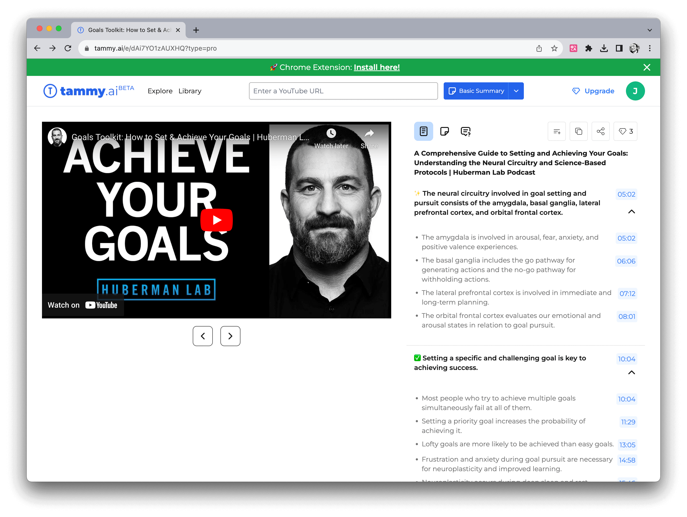
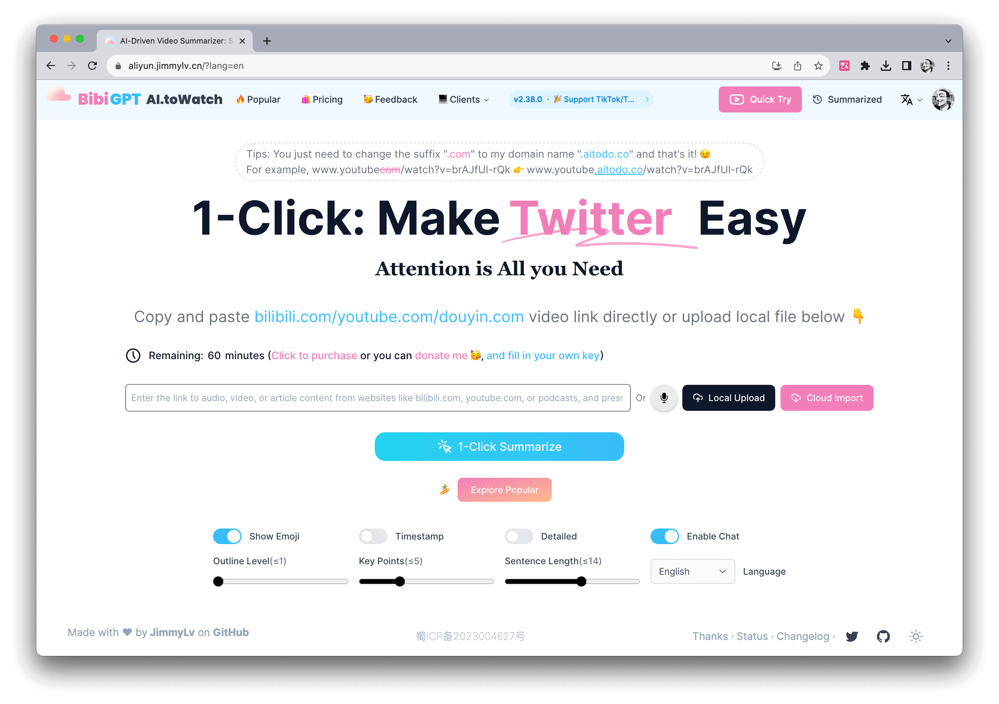
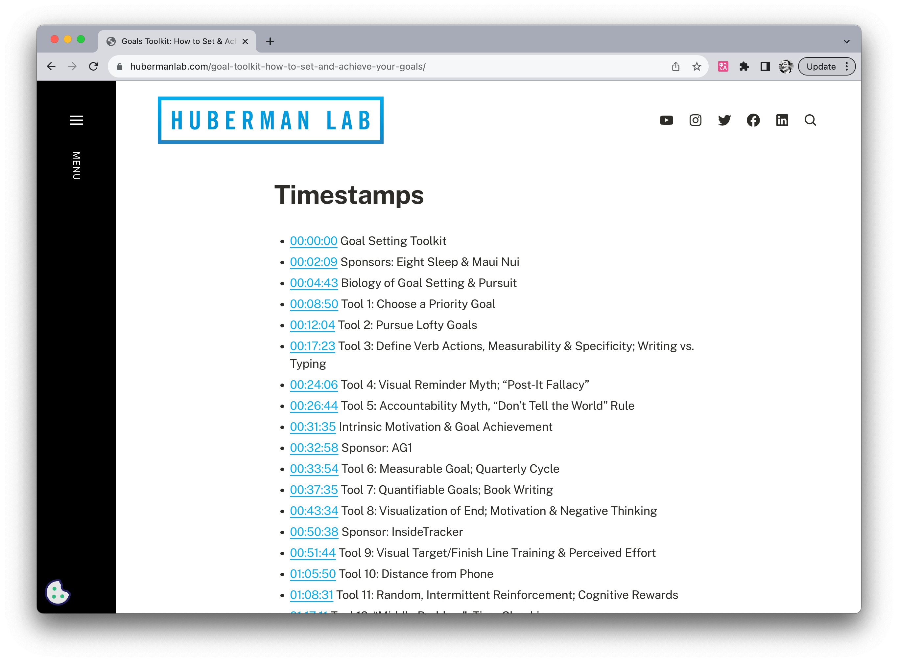
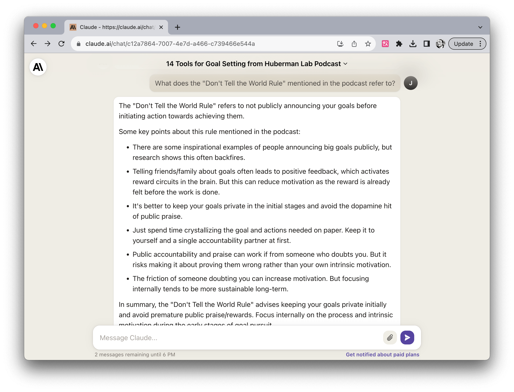

# 使用 AI 工具聽播客和看影片

作者：JimmyWong

如果你有任何好的想法，歡迎加入我們的 [Discord 頻道](https://discord.gg/B7Z7wjuUPg) 進行分享 😁

## 問題

因為興趣的原因，我常常會聽一些英文播客和看一些英文影片，但有些播客或影片內容比較專業，所以聽起來總是有些吃力，尤其是一些口音比較重的播客，經常會遇到聽不懂的情況。這樣就會導致我需要反覆聽，或者是查字典，這樣就會浪費很多時間。

我之前的解決方案是下載播客或影片的字幕，然後邊聽邊看，遇到不懂的地方還會用翻譯軟體翻譯。但這樣做效率比較低。

今年，隨著 ChatGPT 的出現，越來越多與之相關的 AI 工具出現，其中一個比較多人關注的就是 AI 總結播客和影片。我也嘗試了很多工具，試驗了很久，最終總結出來以下三個能顯著提高 AI 總結的準確率的方法，希望能幫助到大家。

## 解決方案

### 1. 挑選適合 AI 總結的播客或影片

首先，根據我的經驗，並不是所有播客或影片都適合 AI 總結或翻譯，因為 AI 並不知道什麼是重點，對於一些閒聊訪談類別的播客，AI 總結的效果就非常不好。目前實驗下來，我認為**「主題較為明確的播客或影片」**比較適合 AI 總結。

以我常聽的播客 Huberman Lab 為例，他的播客主要有兩種，一種是 Dr Andrew Huberman 一個人講解，另一種是他和其他人的訪談。其中，前者的主題比較明確，比如下圖中第一期播客的主題是「如何達成目標」，這樣的播客就比較適合 AI 總結。而後者的主題雖然也比較明確，但因為訪談的時候還是會有很多閒聊，所以 AI 總結的效果就不太好了。

再舉幾個比較適合 AI 總結的播客或影片的例子：

- Ted 影片
- 手機或者數位產品分享影片
- 新聞或者時事類播客或影片

### 2. 分段總結

如果你能夠找到適合 AI 總結的播客或影片，那麼接下來就是如何使用 AI 總結了。目前主流的方法有兩種，第一種是下載播客或影片的字幕，然後將字幕輸入到 AI 工具中進行總結。第二種是直接將播客或影片的 URL 輸入到 AI 工具中進行總結。

第一種方法我一般會用 [Claude](https://claude.ai/)，因為它的最大 Token 比較大，比較適合長播客或影片。但它的缺點是，如果播客或影片比較長，那麼它會將整個播客或影片的內容作為一個整體進行總結，這樣的話，總結的內容會丟失比較多。不過如果你的要總結的影片比較短，且內容很聚焦，比如一些 Ted 演講影片。那麼用 [Claude](https://claude.ai/) 總結就是個不錯的選擇。

第二種方法則是不需要下載字幕，直接將播客或影片的 URL 輸入到 AI 工具中進行總結。這樣的話，AI 工具會自動將播客或影片分段，然後對每個段落進行總結。這樣的話，總結的內容會更加準確。比如 [TammyAI](https://tammy.ai/)：

它的特點是會根據段落進行總結，所以總結的內容會比較準確。如果你看 Bilibili 比較多，也可以試試[BibiGPT](https://bibigpt.co/):

不過這種分段式的總結工具還是有可能會 miss 掉一些部分。所以我還會使用第三種方法。

### 3. 結合 show-note 進行二次詢問

如果你使用的 AI 總結工具是分段式的，那麼你可以結合 show-note 進行二次詢問。比如前面提到的 Huberman Lab 的「如何達成目標」這期播客，它的 show-note 裡有寫這期播客一共講了 14 個能幫助你達成目標的工具，並且還將每個工具的名字也都列了出來，比如其中一個 tool 是這樣的：

> Tool 5: Accountability Myth, 『Don」t Tell the World』 Rule

那你就可以問 AI 工具：播客裡提到的 Don」t Tell the World Rule 是指什麼？

基於這個方法，我將聽播客和看影片的效率提高了 2-3 倍。

不過需要注意的是：即使使用二次詢問，AI 總結的內容也不一定是 100% 準確的，所以如果可以的話，可以去看看原字幕。

