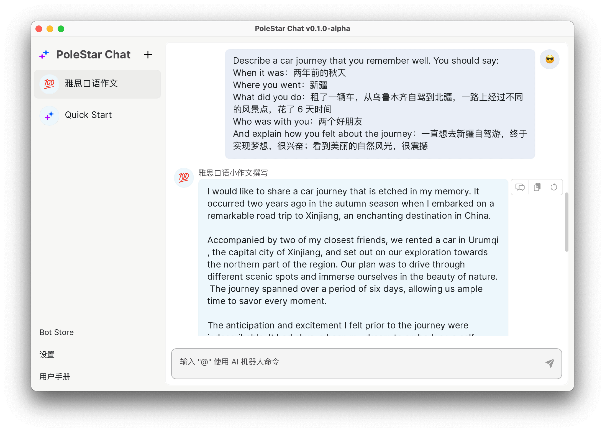
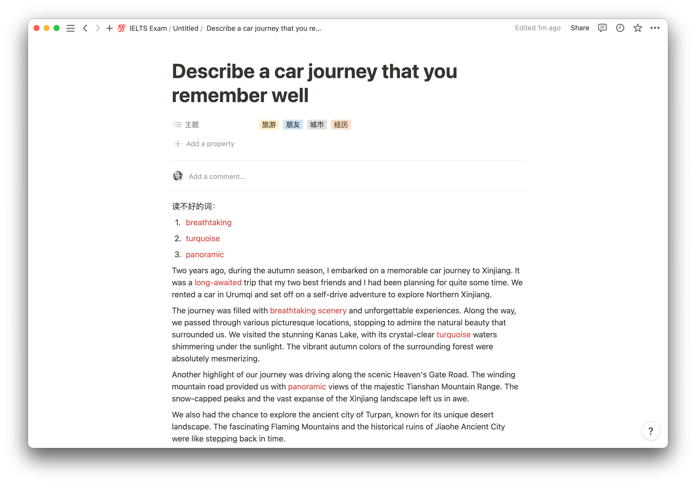
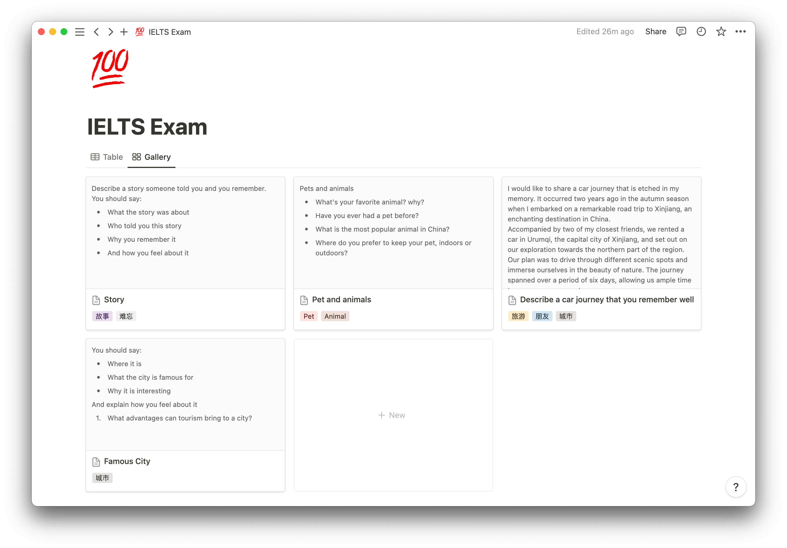
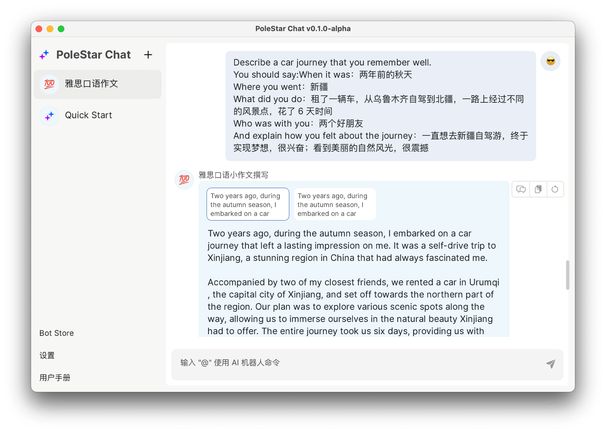
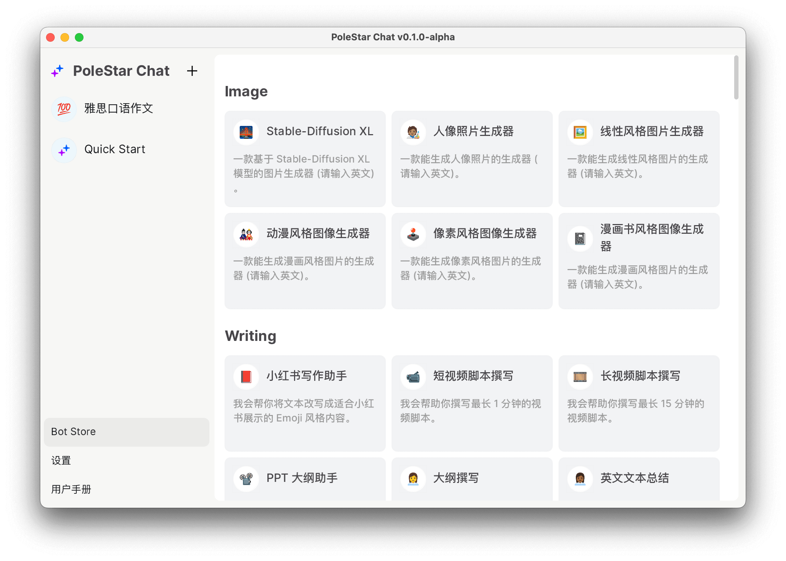

# 使用 AI 備考雅思口語考試

作者：JimmyWong

如果你也有不錯的想法，歡迎加入我們的 [Discord 頻道](https://discord.gg/B7Z7wjuUPg)進行分享 😁

## 問題

雅思口語考試分成以下幾個部分：

- Part 1：考官會讓考生進行自我介紹，並簡單問下考生的一些個人問題，例如身份、興趣愛好等。
- Part 2：考官會交給考生一個答題任務卡、鉛筆和草稿紙做筆記。答題任務卡上會給出一個話題，和一些關鍵問題。考生需要在 1 分鐘內準備，然後在 2 分鐘內根據任務卡上的要求進行陳述。
- Part 3：Q&A，考官會就 Part 2 中的話題進行深入提問，考生需要回答考官的問題。

在口語考試中 Part 2 有點像口語命題作文，以下是一個真實考題：

> Describe a car journey that you remember well. You should say:
> - When it was：
> - Where you went：
> - What did you do：
> - Who was with you：
> - And explain how you felt about the journey：

因為 Part2 有題庫，所以一般考生都會提前準備。做法一般是在考試前先根據題目要求，手寫作文，然後進行記憶或背誦，這樣在考試中就能很快速地完成陳述。但是，考生在準備的時候，往往會遇到以下問題：
1. 題目很多，需要準備很多篇內容。
2. 自己寫的內容不夠好，需要有人幫忙改正。

所以不少考生會選擇付費購買一些樣板，這些樣板一般都是經由專門的老師編寫（甚至有一些是請外教寫的），內容質量相對比較高，但是：

1. 價格一般比較貴。
2. 因為這種服務一般會服務很多學生，所以也無法保證完全不重複的情況。
3. 無法個性化定製內容，記憶起來會比較困難（當然如果你願意付更多的錢，也有提供定製的服務）。

## 初階方案

最近我瞭解到有一位朋友使用 AI 工具輔助備考雅思口語。根據我多名朋友的測試，相對於自己寫的內容，**能夠提高 0.5-1.0 分的分數**，而且還能節省很多準備時間。另外，你也不需要再記錄花錢請別人幫你寫。

我也對這個方案進行了嘗試，發現效果還不錯，所以在這裡分享給大家。

還是以上面那個題目為例，我們可以先用中文寫出自己的答案（最好用自己的真實經歷，這樣記憶或背誦起來會更簡單）：

> Describe a car journey that you remember well. You should say:
> - When it was：兩年前的秋天
> - Where you went：新疆
> - What did you do：租了一輛車，從烏魯木齊自駕到北疆，一路上經過不同的風景點，花了 6 天時間
> - Who was with you：兩個好朋友
> - And explain how you felt about the journey：一直想去新疆自駕遊，終於實現夢想，很興奮；看到美麗的自然風光，很震撼

然後將題目和寫的答案輸入到 AI 工具中，就可以得到一篇範文了：



然後你可以根據自己的實際情況，對生成的內容進行修改，比如刪除掉一些內容（因為口語時間有限，沒法說那麼長），或者是增加一些自己常用的口語高分詞。另外根據習慣，你還可以將不熟悉的詞標註出來：



## 進階方案

因為題庫裡的題目非常多，如果每道題目都寫一篇，那記憶量就太大了。所以還有一個進階的方案，首先你可以在筆記工具裡羅列所有題目，並對題目進行分類，比如這樣：



完成分類後，你可以將類似的題目進行歸類，比如上圖中，最後兩個題目是有相關性的，一個是汽車旅行，一個是城市。那你準備的話題就可以是開車去某個著名城市旅行。

然後你可以將融合後的題目輸入到 AI 工具中，然後再根據自己的實際情況進行修改。這樣原來需要準備幾十篇口語作文，就變成只需要準備幾篇，記憶或背誦量就會大大減少。

另外，目前還有一個問題，現在相對來說比較難控制 AI 生成內容的字元數，所以你需要根據自己的實際情況，對生成的內容進行刪減，這樣才能在考試中更好地控制時間。還有就是可以讓 AI 多生成幾篇，然後進行對比，選出最好的一篇。

為了讓大家方便對比結果，我們的產品 PoleStar Chat 點選 retry 後，支援多 tab 顯示，這樣你就可以很方便地進行對比：




## Prompt

我的 prompt 比較簡單，主要的變數是分數和字元數，你可以根據自己的需求進行更改。不過字元數控制很不準確，我試了幾種方法都不是很理想，後續有好的方法我會再迭代一下。

```
請撰寫一個能在雅思英語口語考試中獲得 7 分的英語口語稿。
注意長度約為 200~220 個英文單詞。要求在文稿裡使用雅思英語口語 7 分單詞。題目和要求如下：
```

你也可以下載我們的應用直接使用這個 Prompt，目前我們的應用預製了多達 100 多種 Prompt 模版：



最後也歡迎各位加入我們的 [Discord 頻道](https://discord.gg/B7Z7wjuUPg)，分享你寫的 Prompt。