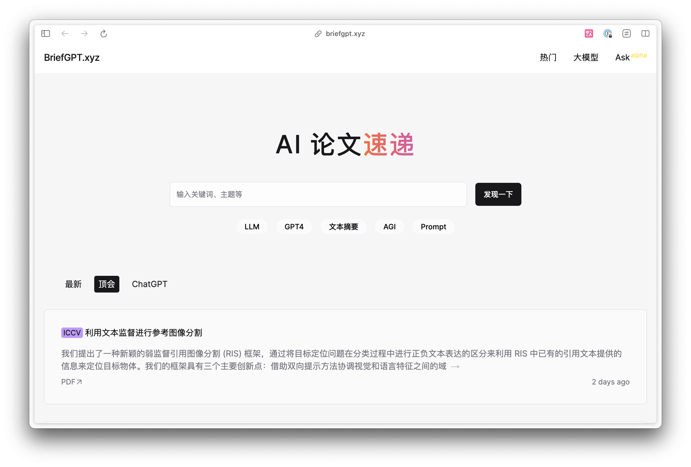
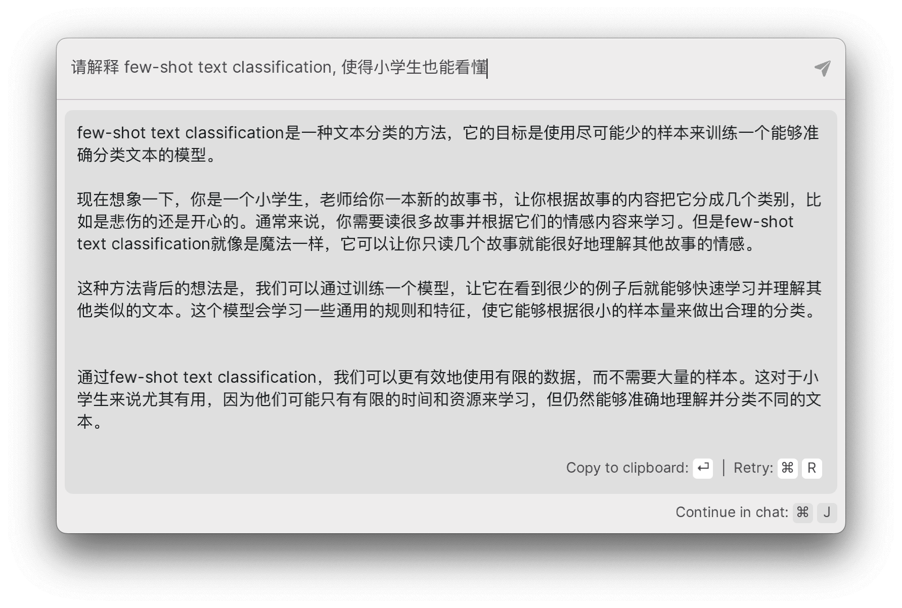

import ReactPlayer from 'react-player/youtube'

# 使用 AI 輔助閱讀

作者：JimmyWong

如果你也有不錯的想法，歡迎加入我們的 [Discord 頻道](https://discord.gg/B7Z7wjuUPg)進行分享 😁

## 問題

最近我一直保持閱讀論文的習慣，有朋友私信問我是如何閱讀論文的，我覺得這個問題很有意思，所以在這裡分享給大家。

閱讀論文的時候，我們經常會遇到以下問題：

- 論文內容比較專業，有些詞彙不太熟悉，如果是英文論文，遇到這些專業詞彙還需要查閱詞典。
- 論文寫得相對晦澀，看不懂。 
- 沒有時間看那麼多的論文。

我的做法是，先用 AI 工具輔助閱讀論文，然後再撰寫筆記。另外，這個方法並不僅僅適用於閱讀論文，對於閱讀其他書籍、文章也是適用的。

## 方法

首先，我一般會用 [AI 論文閱讀速遞](https://briefgpt.xyz/feed/top) 閱讀論文，這個網站會自動從 arXiv 上爬取最新的論文，並用 AI 對論文的標題進行了翻譯，同時還用 AI 進行了總結，看一眼中文標題，以及總結你就可以快速瞭解論文的主要內容。



### 翻譯

遇到感興趣的內容，我就會去看論文的原文，遇到看不懂的內容，我一般都會用 AI 進行翻譯。因為我也開發了一款 AI 工具，所以我一般都會用自己的產品 —— [PoleStar Chat](https://github.com/thinkingjimmy/PoleStarChat/releases)。
操作挺簡單的，首先框選你需要翻譯的內容，然後點選快捷鍵 cmd + c + c，接著就會喚起 PoleStar 的快捷輸入框，同時你框選的內容也會出現在輸入框內。
最後選擇對應的翻譯 bot，點選回車，就可以看到 AI 翻譯的結果了。全程無需輸入任何額外的 prompt，非常方便快捷：

<ReactPlayer width = '100%' playing controls url='https://youtu.be/axtY3pkYHIQ' />

[檢視影片](https://youtu.be/axtY3pkYHIQ)

### 解釋

另外，除了翻譯之外，還有一個我比較常用的是「解釋」，比如遇到我不懂的專業詞彙，亦或者比價難懂的句子，我就會用 AI 用中文進行解釋。
比如這篇論文的結尾比較難懂，我就會讓 AI 嘗試以中文進行解釋，同時我還會要求 AI 換成一種小學生都能懂的表述，複述一遍內容，像這樣：



### 總結

對於最後一個「沒有時間看」的問題，很多朋友的想法是用 AI 對論文或者文章進行總結，但正如我之前在[《AI Summary 會取代人工 Summary 嗎？》](../../../insight/my-insight/will-AI-summary-replace-manual-summary.md)一文中提到：

- AI 並不知道什麼是重點，只閱讀它總結的內容，你有可能會丟失一些重要訊息。
- 在沒有完整閱讀全篇論文的情況下，你沒法確定 AI 生成的總結是準確的

所以我不推薦大家使用 AI 總結論文。但這並不意味著沒法透過 AI 加快你的閱讀速度。

首先對於論文來說，我建議：
- 直接翻譯 Abstract，這樣可以快速瞭解論文的主要內容，如果你對論文感興趣，再決定是否閱讀全文。
- 然後再讓 AI 翻譯論文的最後一部分 Conclusions，這樣可以快速瞭解論文的結論，我一般看完結論就會記筆記，如果看不懂結果，或者好奇研究過程才會去看論文的中間部分。

可能各位看完我的方法，會覺得我過於功利，或者囫圇吞棗。

坦率說來，我一開始也覺得這種方式有點不好，不夠深入。但後來我發現：
- 靠 AI 論文是很難學深入的，要想瞭解細節還是得系統地看書，或者教程。
- AI 相關的發展非常快，論文的作用是讓我保持訊息的敏感性，並從中發現潛在的機會，而不是深入地瞭解其技術（況且論文裡提到的新技術，也不一定能馬上用到）。

所以，不用過分糾結深度問題。而是讓 AI 充當一個過濾器，幫你過濾掉你不感興趣的東西。況且其實有很多論文都不值得讀，沒必要糾結和焦慮。


## Prompt

翻譯：

```
我要求你充當漢語翻譯、拼寫糾正和改進者。我會用任何語言與你交流，你需識別語言並將其翻譯成漢語，並提供糾正和改進後的版本。
請注意，你只能回覆糾正和改進，不要寫解釋。以下是需要翻譯的內容：
```

解釋：

這個可以根據自己的需求進行調整，我一般都會用「讓小學生也能看懂」

```
請解釋 XXX ，使得小學生也能看懂
```