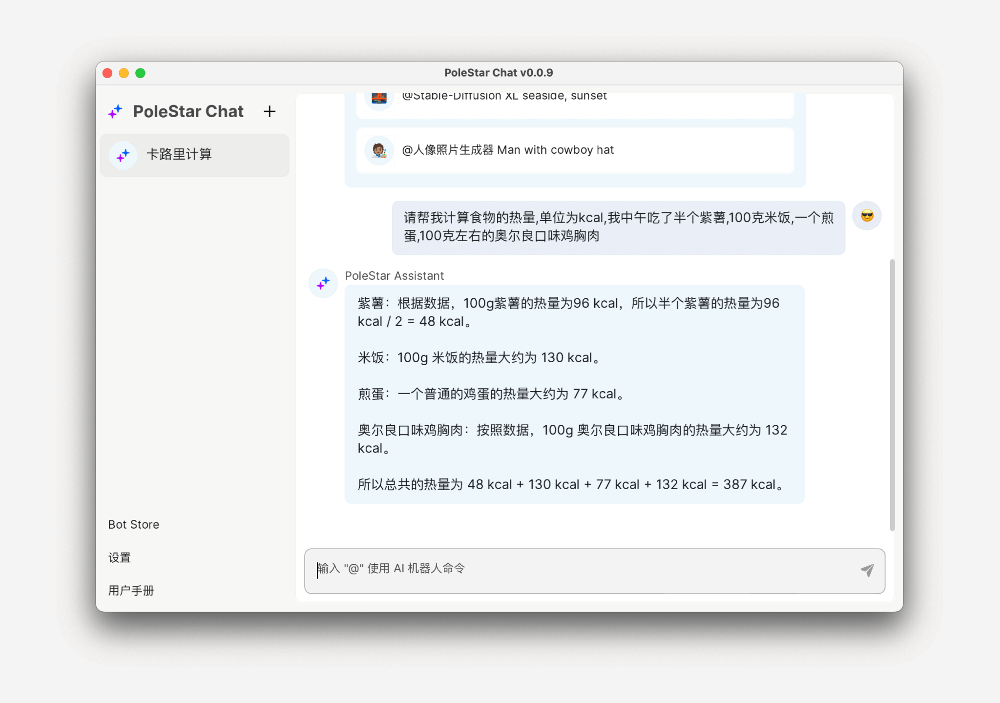
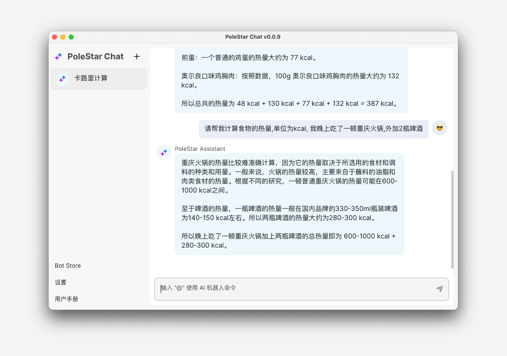
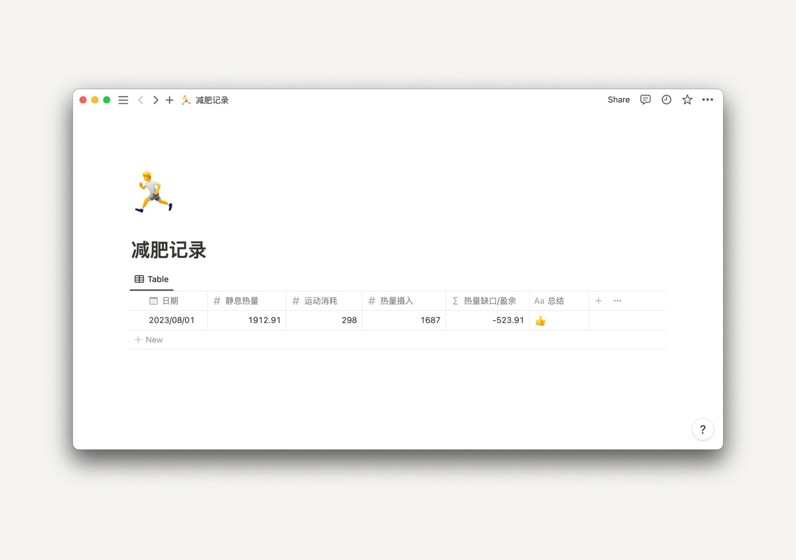
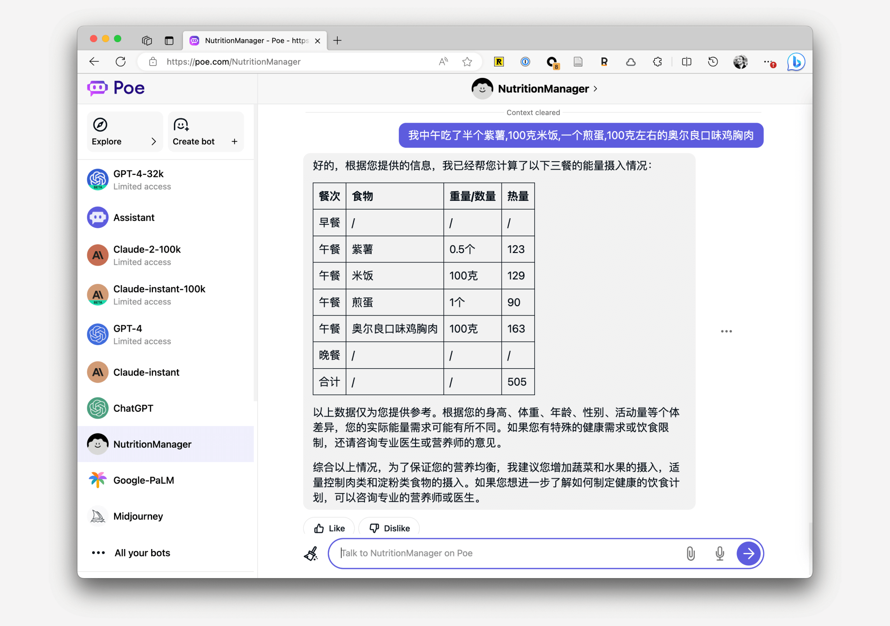
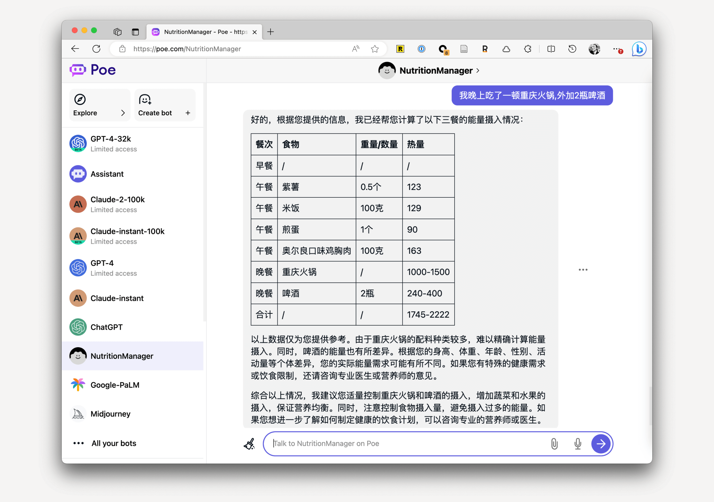

# 使用 AI 記錄每日熱量攝入

import recordCalories06 from '../assets/img/record-calories-06.png'

作者：JimmyWong

如果你也有不錯的想法，歡迎加入我們的 [Discord 頻道](https://discord.gg/B7Z7wjuUPg)進行分享 😁

## 問題

最近半年我一直在減肥，而減肥的關鍵則是製造熱量缺口。製造熱量缺口的方法，除了大家熟知的多運動外，還有就是控制飲食。為了精確計算熱量的缺口，我嘗試過很多計算熱量的 App，都沒法堅持。

有兩個關鍵原因：

1. 大多數 App 記錄熱量的流程比較繁瑣，比如記錄米飯的熱量，你還需要先搜尋米飯，然後輸入你吃的分量的，如果你一頓飯吃了很多東西，完成整個錄入過程最少也要 3、4 分鐘。
2. 中餐做法複雜，資料非常難統計，比如你出去吃一頓火鍋，該如何統計呢？不可能每吃一道菜都進行一次稱重吧。

操作繁瑣，外加統計困難，導致我堅持了一段時間後就放棄了。

## 初階方案

最近我看到有人使用 AI 工具記錄熱量，試用了下，效果非常好，非常方便，基本解決我上述提到的兩個問題。

首先你可以透過文字輸入你吃了什麼東西，然後讓 AI 幫你統計，比如今天中午我就吃了以下幾樣東西，如果用傳統的熱量記錄 App，估計光記錄就要 3、4 分鐘。BTW，你可能擔心裡面的資料不對，我用一些熱量計算 App 查了下，AI 的結果基本跟那些 App 裡的結果大差不差，不過需要注意，量詞越精準，結果一致性會越好，這個後面會有案例提到：



當然還有前面提到的統計困難的火鍋的例子，AI 也能給出答案，如果你吃得比較多，就酌情自己加一些，或者描述精確一些：



接著你就可以將這些統計的資料記錄到各種文件工具裡，方便後續的統計和回顧。我的習慣是記錄在 Notion 裡。

另外，再分享一個我的熱量缺口計算方法，熱量缺口 = 總攝入量 - 總消耗量 = 三餐攝入 -（靜息代謝 + 運動消耗）。我這靜息代謝用的是 [RMR 方法](https://purecalculators.com/zh-CN/rmr-resting-metabolic-rate-calculator)，你也可以使用 [BMR 方法](https://purecalculators.com/zh-CN/bmr-calculator)。最後記得每次記錄完，給自己點個贊：



## 進階方案

如果你嫌資料統計麻煩的話，你也可以試試讓 AI 用 Markdown 格式列出需要記錄的各種營養成分，然後自己再手動複製黏貼到文件工具裡。同時你還能讓 AI 在每頓飯的記錄後面加入一些建議：



記錄完中餐後，還可以繼續輸入晚餐，AI 會繼續在一個表格內記錄：



另外，如果你細看卡路里資料，你會發現 AI 給的卡路里的資料每次都稍微有點偏差。

經過我多次測試，主要還是因為劑量的問題，如果你輸入的是「半個」、「一碗」等不太精準的量詞，AI 的每次結果可能就會不太一樣。不過我覺得問題不大，多次的結果差不了特別多。我又不是備賽，單純日常記錄夠用了。
如果你對結果還是不太滿意，可以試試 GPT-4，經過我的測試，GPT-4 是目前幾個模型中準確性最高的。

## Prompt

我的 prompt 是這樣的：

```
做為一名專業營養管理師。請根據我提供的三餐飲食記錄，幫助我計算營養的攝入，單位 kcal，並使用 Markdown 表格展示。
另外我會分別給你我三餐的飲食，以下是我的要求：

1. 你需要將當天的所有攝入都記錄到同一個表格裡，表格第一列為餐次。
2. 如果無法提供具體的熱量資料，則提供一個區間熱量即可。
3. 注意你僅記錄與計算我告訴你的飲食。

最後給我一些合理的飲食建議。
```

另外，你也可以加一些個人的資料，比如體重、身高等等。這樣 AI 給的建議會更加準確。如果遇到效果不好的情況，不要慌，一點點改，最終會改好的。

最後也歡迎各位加入我們的 [Discord 頻道](https://discord.gg/B7Z7wjuUPg)，分享你寫的 Prompt。

## 特別鳴謝

特別鳴謝即刻使用者阿禪的分享，原始想法來源於他：


