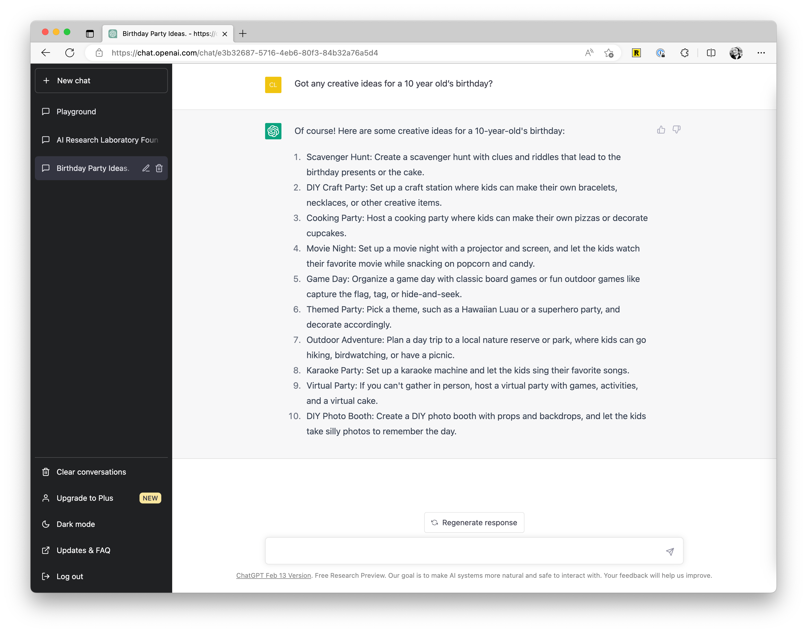

# 基礎用法

:::info 注意
本章節會簡單介紹下 prompt，如果你已經懂得使用 ChatGPT 這類產品的用法，可跳過這一章。
:::

如果你沒怎麼使用過類似 ChatGPT 這類 Chatbot 產品，我簡單說下它的基本用法：

- 你只需要登入 ChatGPT 後，在輸入框內輸入問題，或者指令即可。AI 會根據你的指令，回傳相應的內容，在後續的章節中，我會介紹更詳細的用法與技巧：

- 另外，還有一個特別留意的，ChatGPT 跟你之前用的一些 AI 產品不同，它還支援多輪對話，比如當你問 `What is the capital of China?` (中國的首都是什麼？)，它回答 Beijing，你可以接著問 `How many people are there？` ，你不需要在問題裡重複 Beijing 這個詞。ChatGPT 知道 there 指的就是 Beijing。
