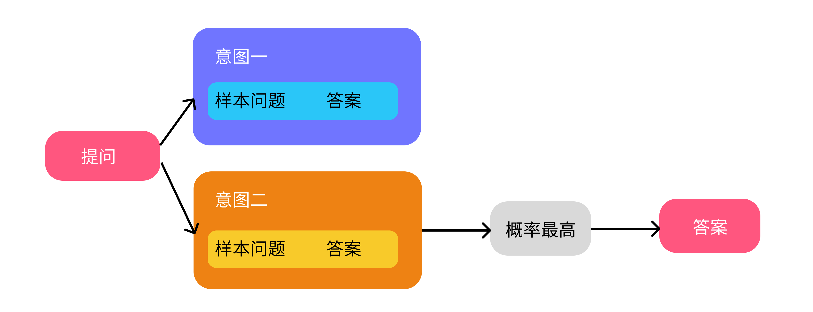
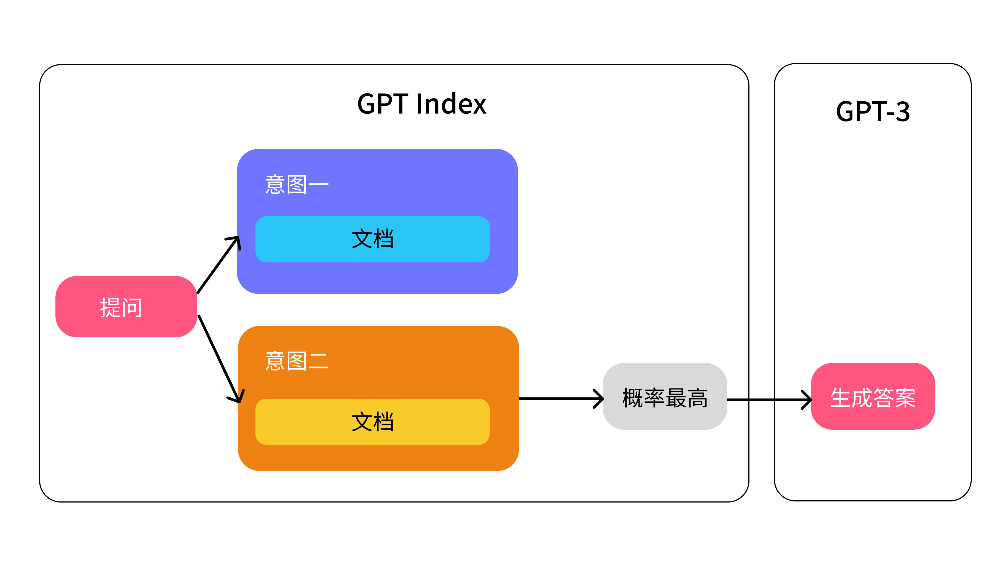
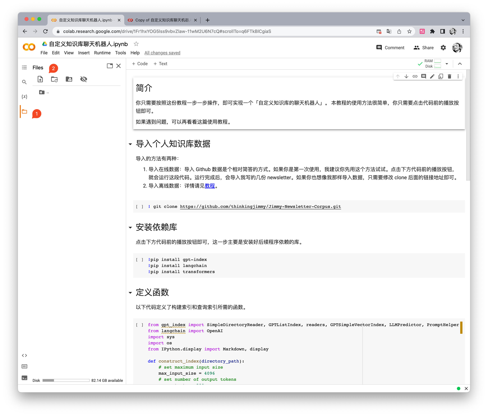
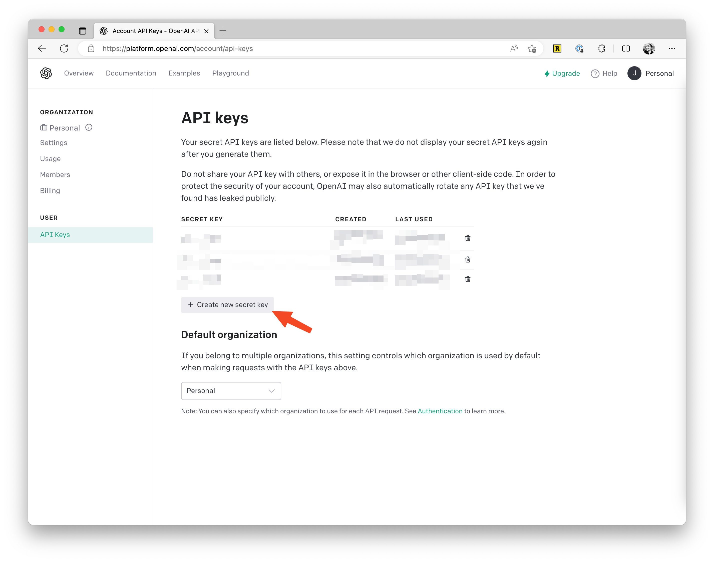

# 搭建基於知識庫內容的機器人

<head>
  <script defer="defer" src="https://embed.trydyno.com/embedder.js"></script>
  <link href="https://embed.trydyno.com/embedder.css" rel="stylesheet" />
</head>

如果你僅想要直接實踐，可以看最後一部分實踐，以及倒數第二部分限制與注意的地方。

## 簡介

這個想法，來源於我的個人需求，我連載了將近 100 期 newsletter，積累了很多內容，我希望將這些資料匯入給 AI，然後 AI 能拿這些資料回答我的問題，甚至能給我一些寫作建議等。

最早的時候，我嘗試過非常笨的方法，就是在提問的時候，將我的 newsletter 文字傳給 AI，它的 prompt 大概是這樣的：

```other
Please summarize the following sentences to make them easier to understand.

Text: """
My newsletter
"""
```

這個方法能用是能用，但目前 ChatGPT 有個非常大的限制，它限制了最大的 token 數是 4096，大約是 16000 多個字元，注意這個是請求 + 回應，實際請求總數並沒那麼多。換句話來說，我一次沒法匯入太多的內容給 ChatGPT（我的一篇 Newsletter 就有將近 5000 字），這個問題就一直卡了我很久，直到我看到了 [GPT Index](https://gpt-index.readthedocs.io/en/latest/) 的函式庫，以及 [Lennys Newsletter](https://www.lennysnewsletter.com/p/i-built-a-lenny-chatbot-using-gpt) 的例子。

試了下，非常好用，而且步驟也很簡單，即使你不懂程式設計也能輕易地按照步驟實現這個功能。

我稍稍最佳化了下例子的程式碼，並增加了一些原理介紹。希望大家能喜歡。

## 原理介紹

其實我這個需求，在傳統的機器人領域已經有現成方法，比如你應該看到不少電商客服產品，就有類似的功能，你說一句話，機器人就會回覆你。

這種傳統的機器人，通常是基於意圖去回答人的問題。舉個例子，我們建立了一個客服機器人，它的工作原理簡單說來是這樣的：



當用戶問「忘記密碼怎麼辦？」時，它會去找最接近這個意圖「密碼」，每個意圖裡會有很多個樣本問題，比如「忘記密碼如何找回」「忘記密碼怎麼辦」，然後這些樣本問題都會有個答案「點選 A 按鈕找回密碼」，機器人會對應最接近樣本問題的意圖，然後回傳答案。

但這樣有個問題，我們需要設定特別多的意圖，比如「無法登入」、「忘記密碼」、「登入錯誤」，雖然有可能都在描述一個事情，但我們需要設定三個意圖、三組問題和答案。

雖然傳統的機器人有不少限制，但這種傳統方式，給了我們一些靈感。

我們好像可以用這個方法來解決限制 token 的問題，我們僅需要傳符合某個意圖的文件給 AI，然後 AI 僅用該文件來生成答案：



比如還是上面的那個客服機器人的例子，當用戶提問「忘記密碼怎麼辦？」時，對應到了「登入」相關的意圖，接著對應知識庫中相同或相近意圖的文件，比如「登入異常處理解決方案文件」，最後我們將這份文件傳給 GPT-3，它再拿這個文件內容生成答案。

GPTIndex 這個函式庫簡單理解就是做上圖左邊的那個部分，它的工作原理是這這樣的：

1. 建立知識庫或文件索引
2. 找到最相關的索引
3. 最後將對應索引的內容給 GPT-3

## 限制與注意的地方

雖然這個方法解決了 token 限制的問題，但也有不少限制：

1. 當用戶提一些比較模糊的問題時，對應有可能錯誤，導致 GPT-3 拿到了錯誤的內容，最終生成了非常離譜的答案。
2. 當用戶提問一些沒有多少上下文的訊息時，機器人有時會生成虛假訊息。

所以如果你想用這個技術做客服機器人，建議你：

1. 透過一些引導問題來先明確使用者的意圖，就是類似傳統客服機器人那樣，搞幾個按鈕，先讓使用者點選（比如無法登入）。
2. 如果相似度太低，建議增加兜底的回答「很抱歉，我無法回答你的問題，你需要轉為人工客服嗎？」

## 實踐

為了讓大家更方便使用，我將程式碼放在了 Google Colab，你無需安裝任何環境，只需要用瀏覽器開啟這個：
[程式碼檔案](https://colab.research.google.com/drive/1Fr1hxYOG5lss9vbvZlaw-11wM2U6N7cQ)

BTW 你可以將其複製儲存到自己的 Google Drive。

:::info
收到不少朋友的反饋，說下面的按鈕沒法點選。下面只是截圖，你需要開啟這個[程式碼檔案](https://colab.research.google.com/drive/1Fr1hxYOG5lss9vbvZlaw-11wM2U6N7cQ)進行操作。
另外，關於答案不符合預期的問題，主要還是向量對應的問題，暫時沒有解決方案。
:::

### 第一步：匯入資料

匯入的方法有兩種，第一種是匯入線上資料。

匯入 GitHub 資料是個相對簡單的方式。如果你是第一次使用，我建議你先用這個方法試試。點選下方程式碼前的播放按鈕，就會執行這段程式碼。


執行完成後，會匯入我寫的幾份 newsletter。如果你也想像我那樣匯入資料，只需要修改 clone 後面的連結地址即可。

第二種方法是匯入離線資料。點選左側的資料夾按鈕（如果你沒有登入，這一步會讓你登入），然後點選下圖標識 2 的上傳按鈕，上傳檔案即可。如果你要傳多個檔案，建議你先建一個資料夾，然後將檔案都上傳到該資料夾內。



### 第二 & 三步：安裝依賴庫

直接點選播放按鈕即可。

不過第三步裡，你可以嘗試改下引數，你可以改：

1. **num_ouputs ：**這個是設定最大的輸出 token 數，越大，回答問題的時候，機器能回答的字就越多。
2. **Temperature：** 這個主要是控制模型生成結果的隨機性。簡而言之，溫度越低，結果越確定，但也會越平凡或無趣。如果你想要得到一些出人意料的回答，不妨將這個引數調高一些。但如果你的場景是基於事實的場景，比如資料提取、FAQ 場景，此引數就最好調成 0。

其他引數不去管它就好，問題不大。

### 第四步：設定 OpenAI API Key

這個需要你登入 OpenAI（注意是 OpenAI 不是 ChatGPT），點選右上角的頭像，點選 View API Keys，或者你[點選這個連結](https://platform.openai.com/account/api-keys)也可以直接訪問。然後點選「Create New Secret Key」，然後複製那個 Key 並貼上到文件裡即可。



### 第五步：建立索引

這一步程式會將第一步匯入的資料都跑一遍，並使用 OpenAI 的 embedings API。如果第一步你上傳了自己的資料，只需要將 ' ' 裡的 Jimmy-Newsletter-Corpus 修改為你上傳的資料夾名稱即可。

**注意：**

- 這一步會耗費你的 OpenAI 的 Credit，1000 個 token 的價格是 $0.02，執行以下程式碼前需要注意你的賬號裡是否還有錢。
- 如果你用的 OpenAI 賬號是個免費賬號，你有可能會遇到頻率警告，此時可以等一等再執行下方程式碼（另外你的匯入的知識庫資料太多，也會觸發）。解除這個限制，最好的方式是在你的 OpenAI 賬號的 Billing 頁面裡繫結信用卡。如何綁卡，需要各位自行搜尋。

### 第六步：提問

這一步你就可以試試提問了，如果你在第一步匯入的是我預設的資料，你可以試試問以下問題：

- Issue 90 主要講了什麼什麼內容？
- 推薦一本跟 Issue 90 裡提到的書類似的書

如果你匯入的是自己的資料，也可以問以下幾個型別的問題：

- 總結
- 提問
- 訊息提取
