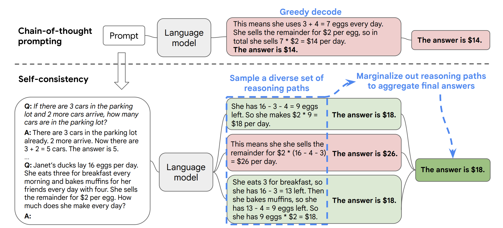

# Self-Consistency

Self-Consistency 自洽是對 Chain of Thought 的一個補充，它能讓模型生成多個思維鏈，然後取最多數答案的作為最終結果。

按照 Xuezhi Wang 等人在 [2022 年發表的論文](https://arxiv.org/pdf/2203.11171.pdf) 表明。當我們只用一個邏輯鏈進行最佳化時，模型依然有可能會算錯，所以 XueZhi Wang 等人提出了一種新的方法，讓模型進行多次運算，然後選取最多的答案作為最終結果：



就我目前使用下來，在 ChatGPT 上，其自洽性非常高，暫時沒有遇到過出現多種答案的情況。查閱多份資料，我發現這個自洽性可能更多的用於評估模型的優劣，好的模型一般自洽性會比較高。

**在此案例中，考慮如下多步推理問題：**

```
Consider a multi-step reasoning problem like the following:

Question: If a store has 10 apples and 8 oranges, and it sells 6 apples and 4 oranges, how many fruits are left in the store?

Instead of directly answering the question, the chain-of-thought prompting would require the language model to produce a series of short sentences that mimic a human's reasoning process:

The store has 10 apples.
The store has 8 oranges.
6 apples are sold.
4 oranges are sold.
There are 10 - 6 = 4 apples left.
There are 8 - 4 = 4 oranges left.
The store now has 4 apples + 4 oranges = 8 fruits.

```

Using self-consistency, the language model generates multiple reasoning paths:

```
Reasoning Path A:

The store has 10 apples.
The store has 8 oranges.
6 apples are sold.
4 oranges are sold.
There are 10 - 6 = 4 apples left.
There are 8 - 4 = 4 oranges left.
The store now has 4 apples + 4 oranges = 8 fruits.
Reasoning Path B:

The store initially has 10 apples and 8 oranges.
It sells 6 apples, so there are 10 - 6 = 4 apples left.
It sells 4 oranges, so there are 8 - 4 = 4 oranges left.
The store now has 4 apples + 4 oranges = 8 fruits.
```

翻譯過來則為：


```
問題：如果一家商店有 10 個蘋果和 8 個橙子，此時店裡賣出了 6 個蘋果和 4 個橙子，那麼店裡還剩下多少水果？

思維鏈提示（chain-of-thought prompting）不是直接回答問題，而是要求語言模型生成一系列模仿人類推理過程的短句：

商店有 10 個蘋果。
店裡有 8 個橙子。
賣了 6 個蘋果。
賣了 4 個橙子。
還剩下 10 - 6 = 4 個蘋果。
剩下 8 - 4 = 4 個橙子。
商店現在有 4 個蘋果 + 4 個橙子 = 8 個水果。
```

使用 Self-consistency，語言模型生成多個推理路徑：

```
推理路徑A：

商店有 10 個蘋果。
店裡有 8 個橙子。
賣了 6 個蘋果。
賣了 4 個橙子。
還剩下 10 - 6 = 4 個蘋果。
剩下 8 - 4 = 4 個橙子。
商店現在有 4 個蘋果 + 4 個橙子 = 8 個水果。

推理路徑 B：

商店最初有 10 個蘋果和 8 個橙子。
商店賣了 6 個蘋果，所以還剩下 10 - 6 = 4 個蘋果。
商店賣了 4 個橙子，所以還剩下 8 - 4 = 4 個橙子。
商店現在有 4 個蘋果 + 4 個橙子 = 8 個水果。
```


Self-consistency 從生成的多個推理路徑中選擇最一致的答案。在這個例子中，推理路徑 A 和 B 都得出相同的答案（8 個水果）。可以看到這種做法增加了模型對最終答案正確的信心。
