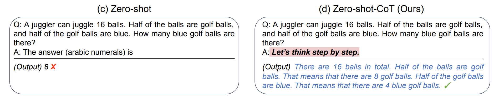
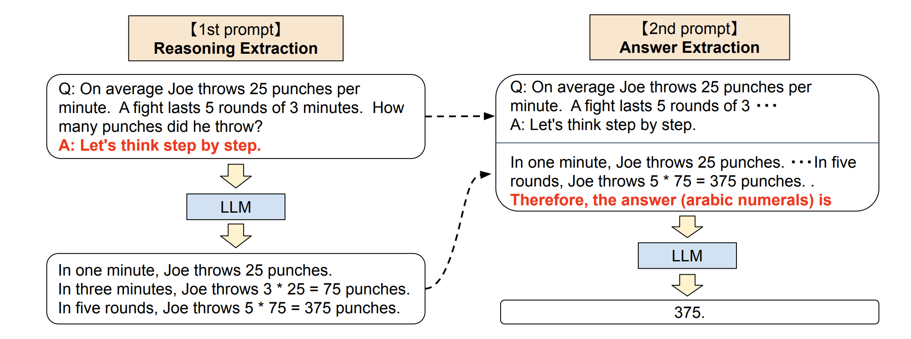

# 技巧 7：Zero-Shot Chain of Thought

<head>
  <script defer="defer" src="https://embed.trydyno.com/embedder.js"></script>
  <link href="https://embed.trydyno.com/embedder.css" rel="stylesheet" />
</head>

基於上述的第三點缺點，研究人員就找到了一個叫 Chain of Thought 的技巧。

這個技巧使用起來非常簡單，只需要在問題的結尾裡放一句 `Let「s think step by step` （讓我們一步步地思考），模型輸出的答案會更加準確。

這個技巧來自於 Kojima 等人 2022 年的論文 [Large Language Models are Zero-Shot Reasoners](https://arxiv.org/abs/2205.11916)。在論文裡提到，當我們向模型提一個邏輯推理問題時，模型回傳了一個錯誤的答案，但如果我們在問題最後加入 `Let「s think step by step` 這句話之後，模型就生成了正確的答案：



論文裡有講到原因，感興趣的朋友可以去看看，我簡單解釋下為什麼（🆘 如果你有更好的解釋，不妨反饋給我）：

1. 首先各位要清楚像 ChatGPT 這類產品，它是一個統計語言模型，本質上是基於過去看到過的所有資料，用統計學意義上的預測結果進行下一步的輸出（這也就是為什麼你在使用 ChatGPT 的時候，它的答案是一個字一個字地吐出來，而不是直接給你的原因，因為答案是一個字一個字算出來的）。
2. 當它拿到的資料裡有邏輯，它就會透過統計學的方法將這些邏輯找出來，並將這些邏輯呈現給你，讓你感覺到它的回答很有邏輯。
3. 在計算的過程中，模型會進行很多假設運算（不過暫時不知道它是怎麼算的）。比如解決某個問題是從 A 到 B 再到 C，中間有很多假設。
4. 它第一次算出來的答案錯誤的原因，只是因為它在中間跳過了一些步驟（B）。而讓模型一步步地思考，則有助於其按照完整的邏輯鏈（A > B > C）去運算，而不會跳過某些假設，最後算出正確的答案。

按照論文裡的解釋，零樣本思維鏈涉及兩個補全結果，左側氣泡表示基於提示輸出的第一次的結果，右側氣泡表示其收到了第一次結果後，將最開始的提示一起拿去運算，最後得出了正確的答案：



這個技巧，用於解複雜問題有用外，還適合生成一些連貫主題的內容，比如寫長篇文章、電影劇本等。

但需要注意其缺點，連貫不代表它就一定不會算錯，如果其中某一步驟算錯了，錯誤會因為邏輯鏈，逐步將錯誤積累，導致生成的文字可能出現與預期不符的內容。

另外，根據 Wei 等人在 [2022 年的論文](https://arxiv.org/pdf/2201.11903.pdf)表明，還有它僅在大於等於 100B 引數的模型中使用才會有效。如果你使用的是小樣本模型，這個方法不會生效。

---

2023-04-12 更新（感謝[qq-740943515](https://github.com/qq-740943515)分享）：
根據 Yongchao Zhou 等人的[最新論文](https://sites.google.com/view/automatic-prompt-engineer)，更好的 prompt 是：

```
Let's work this out in a step by step way to be sure we have the right answer.
```

---

在吳恩達的 ChatGPT Prompt Engineering [課程](https://www.deeplearning.ai/short-courses/chatgpt-prompt-engineering-for-developers/)中，有提到一個這個技巧的另一種用法，不僅僅只是讓 AI 按步驟行事，還會告知 AI 每一步要做什麼。比如這個案例（注意這個是 python 程式碼）：

```
prompt_2 = f"""
Your task is to perform the following actions:
1 - Summarize the following text delimited by
  <> with 1 sentence.
2 - Translate the summary into French.
3 - List each name in the French summary.
4 - Output a json object that contains the
  following keys: french_summary, num_names.

Use the following format:
Text: <text to summarize>
Summary: <summary>
Translation: <summary translation>
Names: <list of names in Italian summary>
Output JSON: <json with summary and num_names>

Text: <{text}>
"""
```

簡單解釋下這個程式碼：

1. 開頭是讓 AI 按照 1 ～ 4 步執行
2. 然後再讓 AI 根據特定格式輸出內容

最後 AI 的輸出是這樣的：

```
Summary: Jack and Jill go on a quest to fetch water, but misfortune strikes and they tumble down the hill, returning home slightly battered but with their adventurous spirits undimmed.
Translation: Jack et Jill partent en quête d'eau, mais la malchance frappe et ils dégringolent la colline, rentrant chez eux légèrement meurtris mais avec leurs esprits aventureux intacts.
Names: Jack, Jill
Output JSON: {"french_summary": "Jack et Jill partent en quête d'eau, mais la malchance frappe et ils dégringolent la colline, rentrant chez eux légèrement meurtris mais avec leurs esprits aventureux intacts.", "num_names": 2}
```

上述的案例只是將任務拆解，能讓 AI 生成的結果更加符合要求，這個方法同樣能提升 AI 的回答準確性，比如這個案例：

```
Determine if the student's solution is correct or not.

Question:
I'm building a solar power installation and I need help working out the financials.

Land costs $100 / square foot

I can buy solar panels for $250 / square foot

I negotiated a contract for maintenance that will cost \
me a flat $100k per year, and an additional $10 / square foot
What is the total cost for the first year of operations
as a function of the number of square feet.

Student's Solution:
Let x be the size of the installation in square feet.
Costs:

Land cost: 100x

Solar panel cost: 250x

Maintenance cost: 100,000 + 100x
Total cost: 100x + 250x + 100,000 + 100x = 450x + 100,000

```

AI 的回答是「The student's solution is correct」。但其實學生的答案是錯誤的，應該 360x + 100,000，我們將 prompt 調整成這樣：

```python
prompt = f"""
Your task is to determine if the student's solution \
is correct or not.
To solve the problem do the following:
- First, work out your own solution to the problem.
- Then compare your solution to the student's solution \
and evaluate if the student's solution is correct or not.
Don't decide if the student's solution is correct until
you have done the problem yourself.
Use the following format:
Question:
###
question here
###
Student's solution:
###
student's solution here
###
Actual solution:
###
steps to work out the solution and your solution here
###
Is the student's solution the same as actual solution \
just calculated:
###
yes or no
###
Student grade:
###
correct or incorrect
###
Question:
###
I'm building a solar power installation and I need help \
working out the financials.
- Land costs $100 / square foot
- I can buy solar panels for $250 / square foot
- I negotiated a contract for maintenance that will cost \
  me a flat $100k per year, and an additional $10 / square \
  foot
  What is the total cost for the first year of operations \
  as a function of the number of square feet.
###
Student's solution:
###
Let x be the size of the installation in square feet.
Costs:
1. Land cost: 100x
2. Solar panel cost: 250x
3. Maintenance cost: 100,000 + 100x
   Total cost: 100x + 250x + 100,000 + 100x = 450x + 100,000
###
Actual solution:
"""
```

本質上，也是將任務分拆成多步，這次 AI 輸出的結果是這樣的（結果就是正確的了）：

```
Let x be the size of the installation in square feet.

Costs:

1. Land cost: 100x
2. Solar panel cost: 250x
3. Maintenance cost: 100,000 + 10x

Total cost: 100x + 250x + 100,000 + 10x = 360x + 100,000

Is the student's solution the same as actual solution just calculated:
No

Student grade:
Incorrect
```
