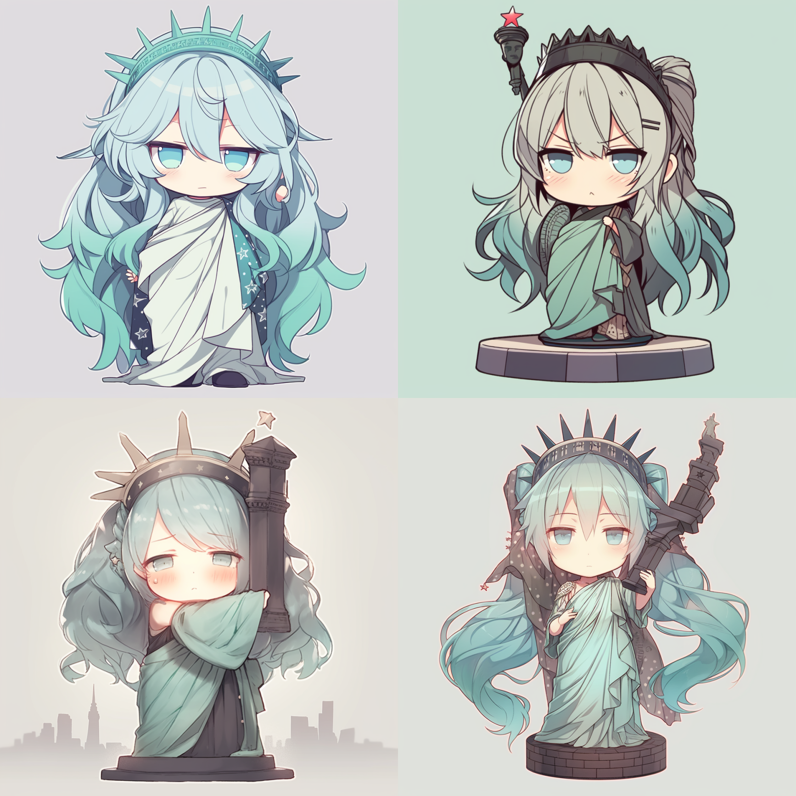
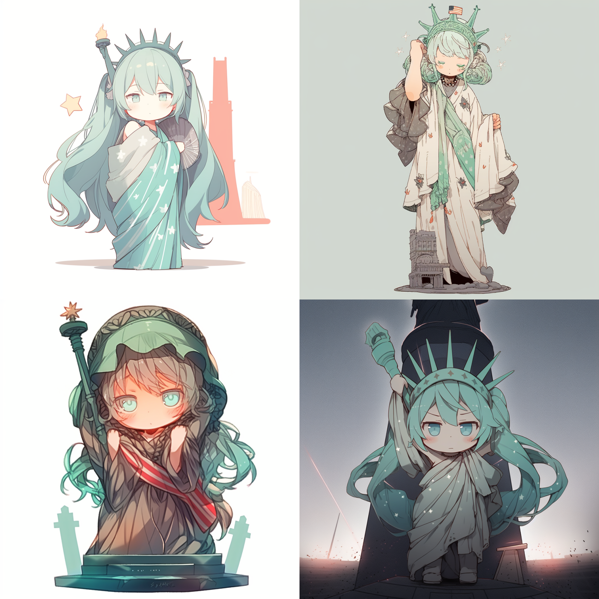
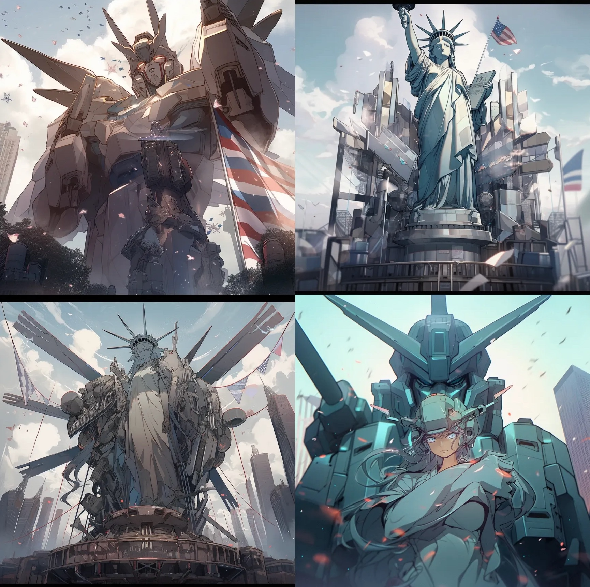

# 場景10：動漫

剛好，在寫這一章的時候，Midjourney 發布了其 Niji 的 V5 版本，所以我以下 prompt 我都會在 —niji 5 的引數下執行。

## 多種 Anime Style

在 niji 5 模型下，預設生成的內容都會自帶 Anime 風格，你可以在 prompt 語句的風格部分中新增國家、年代和創作者，還有一種方法是加動漫風格，根據 [Midlibrary](https://www.midlibrary.io/midguide/niji-anime-version-of-midjourney-v4) 的統計，Midjourney 支援的 Anime Style 超過 120 多種。

我這裡就不羅列了，詳細的清單可以看我整理的 List 或者直接去 Midlibrary，它們總結的是真的好。

我這裡只分享幾個我覺得不錯，且模型支援得也不錯的風格（prompt 主體都是 Statue Of Liberty**）**：

| <div style={{width:180}}>**照片**</div>  | **名稱**                     | **介紹**                                                                                                                                            |
| ------ | -------------------------- | ------------------------------------------------------------------------------------------------------------------------------------------------- |
|        | Chibi Anime Style          | Chibi Anime Style 是指卡通迷你風格。是一種獨特的繪畫風格，特別受到日本動漫迷和卡通迷的喜愛。該風格的特點是將角色繪製成縮小版的樣式，更加可愛和卡通化。在這種風格下，一些角色的頭比正常比例大得多，人物的描繪也更加簡化，並且動畫在繪製時常常用短暫時間的快速動作來傳遞動態效果。 |
|        | Gakuen Anime Style         | Gakuen Anime Style是指在日本動漫中常見的一種風格，主要呈現校園生活與高中生活的情境。這種風格的作品通常涉及到學生會、文化節、戀愛、友情、競爭等校園主題，角色也往往是年齡在16-18歲之間的學生。                                        |
|        | Gekiga Anime Style         | Gekiga Anime Style是一種比較沉重、嚴肅的日本漫畫風格，常常涉及社會問題、人生哲理等成人主題。這種風格的特點是以黑色、灰色為主色調，影象表現力較強，人物表情和行為也更加真實。                                                   |
|        | J Horror Anime Style       | J Horror Anime Style是指恐怖題材的日本動漫風格，這種風格的作品常常涉及靈異、鬼怪、妖怪等超自然力量。                                                                                      |
|        | Jidaimono Anime Style      | Jidaimono Anime Style是指日本歷史劇題材的動漫風格，通常呈現古代日本的歷史背景和文化特徵。這種風格的作品往往描繪戰爭、家族鬥爭、忍者、武士道、神話傳說等元素，以及用具有濃重日本特色的藝術表現手法來傳遞歷史文化的內涵。                            |
|        | Kawaii Anime Style         | Kawaii Anime Style是一種非常可愛和萌的動漫風格，通常呈現出像動物、小孩、角色等可愛的形象。這種風格的作品以顏色鮮明、輪廓粗糙、臉部表情誇張為主要特點。                                                              |
|        | Mecha Anime Style          | Mecha Anime Style是以機器人為主題的日本動漫風格，通常呈現出大型機器、機甲戰爭、鐵甲舞者等元素。這種風格的作品常常運用科幻、未來世界設定、大規模戰鬥等元素，以及動態的戰鬥場面和機器人設計，塑造出複雜的機器人世界和角色人物關係。                         |
|        | Realistic Anime Style      | Realistic Anime Style是一種真實主義的日本動漫風格，通常呈現出秉持著更加現實和真實的人物形象和情節。這種風格的作品表現力很強，人物形象、環境場景等具有更多的細節，刻劃出更為真實的情感世界。                                          |
|        | Semi-Realistic Anime Style | Semi-Realistic Anime Style是在Realistic Anime Style和 Anime Style之間的一個中間狀態的風格，風格上比較真實，但是仍帶有一定的動漫風格。這種風格的作品通常涉及到帶有現實性的情節和人物，但是也常常運用到動漫風格的表現手法。        |
|        | Shoji Anime Style          | Shoji Anime Style是按照日本漫畫家小學館長生涯逐步形成的一種風格。這種風格的作品，通常以聚焦單個人物或小團體的故事為主線。其特點是畫面明亮，顏色和諧，人物表情和行為搞笑誇張，情節簡潔易懂。                                            |
|        | Kemonomimi Anime Style     | Kemonomimi Anime Style是一種帶有動物耳朵和尾巴等特徵的日本動漫風格，通常以人類或近似人類的形象呈現，但卻帶有不同種類的動物耳朵和尾巴等特徵。這種風格的作品與少女漫畫(girls' manga)、少年漫畫(boys' manga)等風格都有一定的關係。          |

## 將圖片轉為動漫風格

這個用到我們之前教的 img2img 功能，你只需要在 prompt 里加入圖片 URL，然後加上以下 prompt 即可（為了更像原圖，我加了 iw 引數）:

```other
panel from manga --iw 2
```

另一個我加了Naoko Takeuchi（美少女戰士的作者），模型還是不善於生成人手：


