# 場景7：實物

## 讓 ChatGPT 生成提示詞是不是更好？

我有用 ChatGPT 輔助我生成提示詞，但沒有用 Role 模式，而是讓它：

1. 翻譯：我知道我想要的東西，但不知道其英文描述。
2. 解答：我需要一些風格詞，但我不知道輸入啥時，就會問 ChatGPT ，比如「文藝復興時期的著名藝術家有哪些？」

我為何沒有用 Role 模式？

的確，讓 ChatGPT 以 Role 模式幫我生成內容，比較省時省力，但我個人覺得：

1. 使用比較麻煩，需要輸入很多提示，即使透過 App 儲存，在多次輸入後，就會超過 token 限制，又要重新輸入。
2. 從 ChatGPT 的原理上看，它只會生成一個「普通」的內容，很難獲得超過預期的內容。只是說大多數人甚至連「普通」都達不到，所以才會震驚於它的效果。所以如果你想要生成原創驚豔的圖，靠機率是不行的，要靠你的想象力。

不過，這也是我一家之言，如果你覺得這樣效率更高，那就用吧~

沒啥關係，適合自己的工具才是好工具。

## 玩具

OK 言歸正傳，從本章開始，我們會逐步豐富我們的 prompt 框架，讓圖片有更多的細節。實物生成的第一個是場景是玩具，是個非常有意思的場景。

另外，這個場景如果能跟 3D 印表機結合一下，我覺得會非常贊。不知道有沒有有志之士能實現一下。

再解釋下 prompt 有哪些更新，從實物這張開始，我講「背景」調整為「環境」，即主體環境，包括背景、燈光等等：

|         | **Prompt**                        | **解釋**                                           |
| ------- | --------------------------------- | ------------------------------------------------ |
| 型別是什麼？  | product photography               | 產品照片                                             |
| 主體是什麼？  | Stormtrooper, plastic, toy        | 繼續用風暴兵和達斯維達為例。因為手辦一般都是塑料玩具，所以加了兩個詞               |
| 環境是怎樣的？ | white background, studio lighting | 背景：為了突出手辦，強調一下白色背景 燈光：增加一些燈光，突出產品 |
| 構圖是怎樣的？ | null                              | 不太重要，就讓 AI 自由發揮                                  |
| 用什麼鏡頭？  | null                              | 不太重要，就讓 AI 自由發揮                                  |
| 是什麼風格？  | hand painted,                     | 我查了下，好像手辦的風格應該只有手繪？                              |

另外一個是遊戲王裡的藍眼白龍，可惜 Midjourney 並不知道啥是 Yu-Gi-Oh，只能按字面意思生成了一個：

|        | **Prompt**                           | **解釋**                             |
| ------ | ------------------------------------ | ---------------------------------- |
| 主體是什麼？ | Blue-Eyes White Dragon, plastic, toy | 繼續用風暴兵和達斯維達為例。因為手辦一般都是塑料玩具，所以加了兩個詞 |

以下是生成的圖片：


另外，我發現 Midjourney 對美式動漫或電影作品支援會好很多，比如冰與火之歌裡的龍媽（只是龍有點詭異），還有聖女貞德：


## 技巧十一：增加風格——國家

說到手辦，大家應該第一反應會想起日本，再介紹一個技巧，在 prompt 里加入 Japanese style 即可，拿聖女貞德作手辦，以及之前做的 logo 作為例子：


聖女貞德是不是有種 FF 的感覺？Logo 也比較簡潔，貓的外觀也有點像動漫裡貓的外觀，當然除了 Japanese 還有 Chinese（左邊4張），甚至 African Style：


## 技巧十二：增加權重

各位有沒有發現，上面那個 Chinese 手辦生成的結果好像只有第三張是中國人面孔？原因是 Chinese style 的權重太低，所以僅輸出了一個結果。你在實踐的過程中，也肯定會遇到，AI 忽略了某些 prompt 詞的情況，比如你提到畫面中要有一隻鳥，但它就是沒畫出來。

那為何會產生這樣的結果？原因 Midjourney 的 prompt 權重是按照順序逐個降低（詳情請見我翻譯的 Midjourney 官方 FAQ），在我們上面的 prompt，我們將 Chinese Style 放到了最後，所以生成的結果也是最少的。忽略了某些詞，這個原因暫時為止，但應該很可能是權重導致的問題。

**增加權重的方法有很多，最簡單的方法就是調整順序**，比如將上面的 Chinese Style 放到最前面（然後生成的結果就是眯眯眼 style 了 🤣，我生成了兩次，第二次好一些）：

```other
product photography, Chinese Style,Joan of Arc, full body, hand painted, plastic, detailed, white background, studio lighting
```

調整下順序，效果就大不一樣，所以各位不要迷信所謂的 prompt 樣板，多試試。


**第二種方法是 Slider 方法。**

你需要在 prompt 最後加  ，然後加上你需要調整權重的詞語，接著再加  ，最後加上權重值。比如還是上面的例子，我想突出 Chinese style 但不想調整順序，就可以改為：

```other
product photography,Joan of Arc, full body, hand painted, plastic, detailed, white background, studio lighting, Chinese Style :: Chinese Style :: 0.5
```

然後你會發現，好像權重太高了，生成了跟 prompt 無關的圖（下方左圖），那我們可以在原來的基礎上，再加以下 Joan of Arc 的權重（下方右圖）：

```other
product photography,Joan of Arc, full body, hand painted, plastic, detailed, white background, studio lighting, Chinese Style :: Joan of Arc:: 0.25 style of Chinese:: 0.5
```

你可以看到，調整引數後，生成的 4 張圖有 2 張具備較強的 Chinese 風格：


不過坦率說來，這個方法，並不特別適合這個案例，調整主體內容，或者順序， ROI 會更高一些，這個方法更適合 miss 掉某個 prompt 詞時使用，比如官方的案例是這樣的：

```other
several sad cats watch a crying woman in a home-office environment with laptop
```

生成的圖片裡（左四張圖），貓咪們都看著你（你可能才是 crying woman 😂），如果用 slider 的功能（右邊四張），crying woman 就出現在畫面裡了：

```other
several sad cats watch a crying woman in a home-office environment with laptop:: several sad cats::0.5 crying woman::0.6 laptop::0.7
```

另外需要注意，slider 可用的引數有 0.25、0.5、0.6、0.7，也可以用這個方法降低權重，區間是 -0.7、-0.6、-0.5、-0.25：


如果你用了 slider 還是沒有出現應該有的畫面，**那還有一個大招 cowbell**，坦率說來，這個並不符合 Midjourney 的官方最佳實踐，但的確是個可行的方法，以下面這個 prompt 為例，生成的圖片裡，woman 看起來並不 shy（左邊四張圖）：

```other
A songbird sits on the shoulder of a shy blonde woman dressed in white.
```

此時你可以重複重複再重複（我覺得這就是為何這個方法叫 cowbell 的原因）：

```other
A songbird sits on the shoulder shoulder shoulder shoulder shoulder shoulder of a shy shy shy shy shy shy shy blonde woman dressed in white.
```


## 食物

另一個我比較喜歡的實物是食物，食物講究的是「色香味俱全」，所以在描述食物類別的 prompt 時，可以往這三個方向想想：

- 色：食物是什麼顏色的（可以透過食物的熟度來控制）。
- 香：照片沒有香味，但我們可以把香氣畫出來。
- 味：照片也同樣沒有味道，那我們加一點細節裝飾？比如撒上胡椒、鹽、辣椒？

|         | **Prompt**                                                      | **解釋**                           |
| ------- | --------------------------------------------------------------- | -------------------------------- |
| 型別是什麼？  | food photography                                                | 食物照片                             |
| 主體是什麼？  | steak, medium rare, steaming, light garnishes, sitting on plate | 牛排，五分熟，帶蒸汽，僅有一點配菜，放在一個碟子上        |
| 環境是怎樣的？ | epic lighting                                                   | 為了突出食物，我加了個聚光燈                   |
| 構圖是怎樣的？ | null                                                            | 不太重要，就讓 AI 自由發揮                  |
| 用什麼鏡頭？  | depth of field                                                  | 為了突出食物，我加了背景虛化，這是背景虛化的另一種表達（有景深） |
| 是什麼風格？  | null                                                            | 不太重要，就讓 AI 自由發揮                  |
| 引數      | null                                                            | 沒有加任何引數                          |

然後再來一碗紅燒牛肉麵：


## 技巧十三：善用燈光

坦誠地跟大家說，我不是設計師，也不是攝影師（而且我非常不擅長攝影），所以我僅能跟大家分享一下基礎內容，因為這個對我來說，太多過程性知識了，不實際操作過，根本不知道有什麼。

言歸正傳，攝影中，常用攝影燈光有以下幾種：

1. 主燈 (Key Light)：主燈是最基本的攝影燈光之一，通常放置在被拍攝物體的正前方或正側方，用於照明主體，決定拍攝物體的主要明暗度。主燈通常是亮度最高的燈光。
2. 填光燈 (Fill Light)：填光燈用於彌補主燈照射的陰影部分，調整陰影的深淺程度，使照片明亮一些。通常填充光應該比主光暗一些，以避免出現過度曝光。
3. 逆光燈 (Back Light)：逆光燈用於照射被拍攝物體的背面，能夠區別出主體和背景，並使物體輪廓變得清晰，常用於拍攝骨感、重物感和逆光效果的照片等。
4. 環境光 (Ambient Light)：環境光就是攝影環境自然產生的光線，包括室內照明、自然光、街燈等，它可以補充被拍攝物體的表面，提升照片的自然度和真實感。
5. 故事性燈光 (Special Light)：通常是為了製造出某種情境或者表達某種意義而使用的，例如燭光、亮光等。它們能夠產生溫暖、浪漫、神秘等場景和氣氛，以探索和表達藝術的想象力和創造力。

基於這些燈進行排列組合，你會得到不同使用場景的燈光。燈光的細節種類，可以去我歸納的 Lighting List 裡檢視，我這裡主要分享一些常用和易用的場景燈光：

| <div style={{width:180}}>**照片**</div> | **名稱**                   | **介紹**                                                                                                                       | **適合場景**                                                                                                                                       |
| ------ | ------------------------ | ---------------------------------------------------------------------------------------------------------------------------- | -------------------------------------------------------------------------------------------------------- |
|  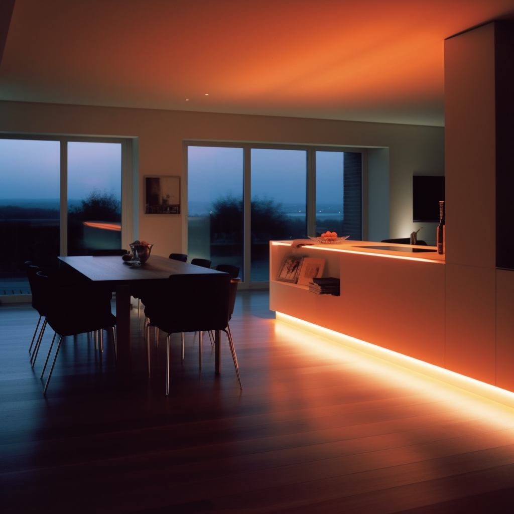    | Mood Lighting            | 氛圍燈。主要是透過在特定的環境中改變燈光的顏色和亮度等引數來創造一種特定的氛圍，以營造舒適、浪漫、放鬆等感覺。從技術實現上看，Mood lighting則著重於燈光的顏色和亮度控制，注重創造強烈的視覺效果。                  | Mood lighting通常用於室內設計、酒店、餐廳及居家裝飾等領域，旨在創造出一種特定的氣氛和體驗。                                                                                           |
|  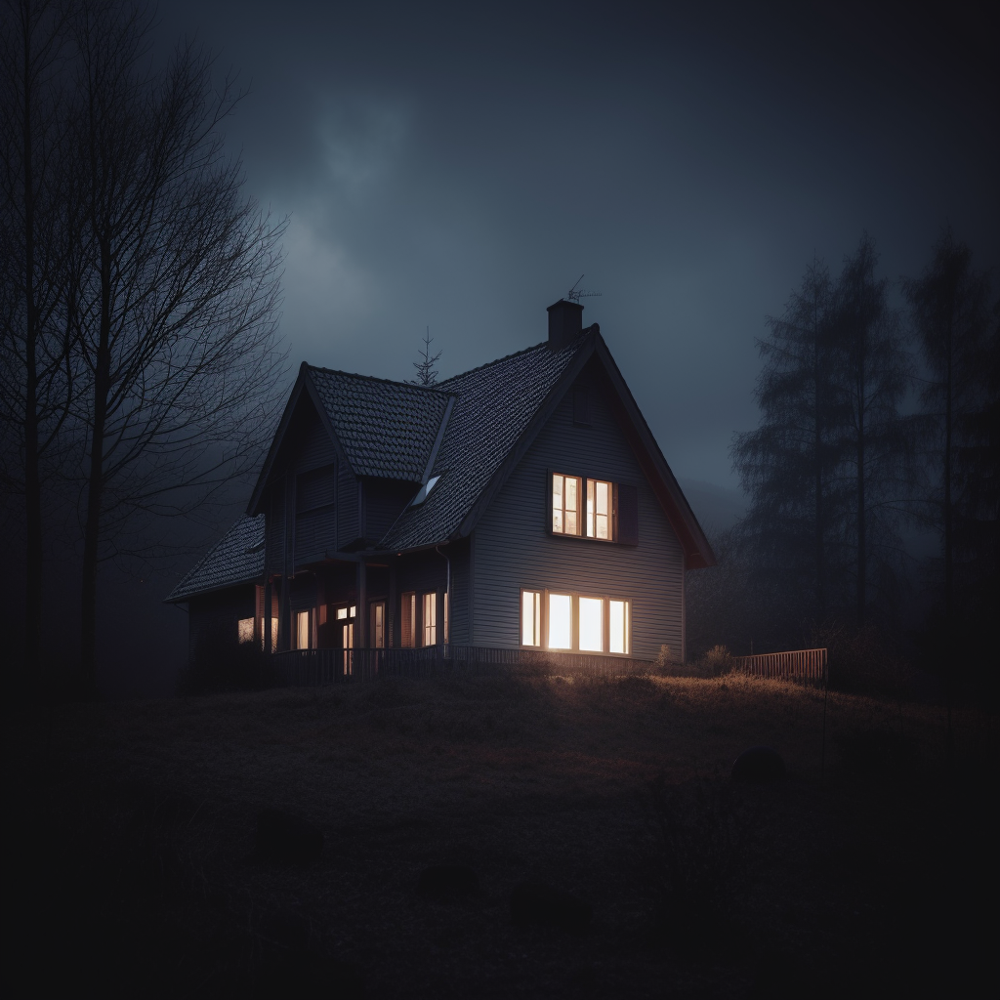     | Moody Lighting           | 情緒燈。它更強調在情感表達和為故事情節服務方面的應用，設計的目的是要把燈光與劇情完美結合起來，以展現角色的個性和情感世界。從技術實現上看，Moody lighting通常採用低亮度和大比例遮擋陰影，強調暗部的掃描，以增加畫面的紋理和層次感。 | Moody lighting通常用於影視製作、遊戲介面、舞台表演等領域，設計的目的是為了增加故事情節的戲劇效果。                                                                                       |
|  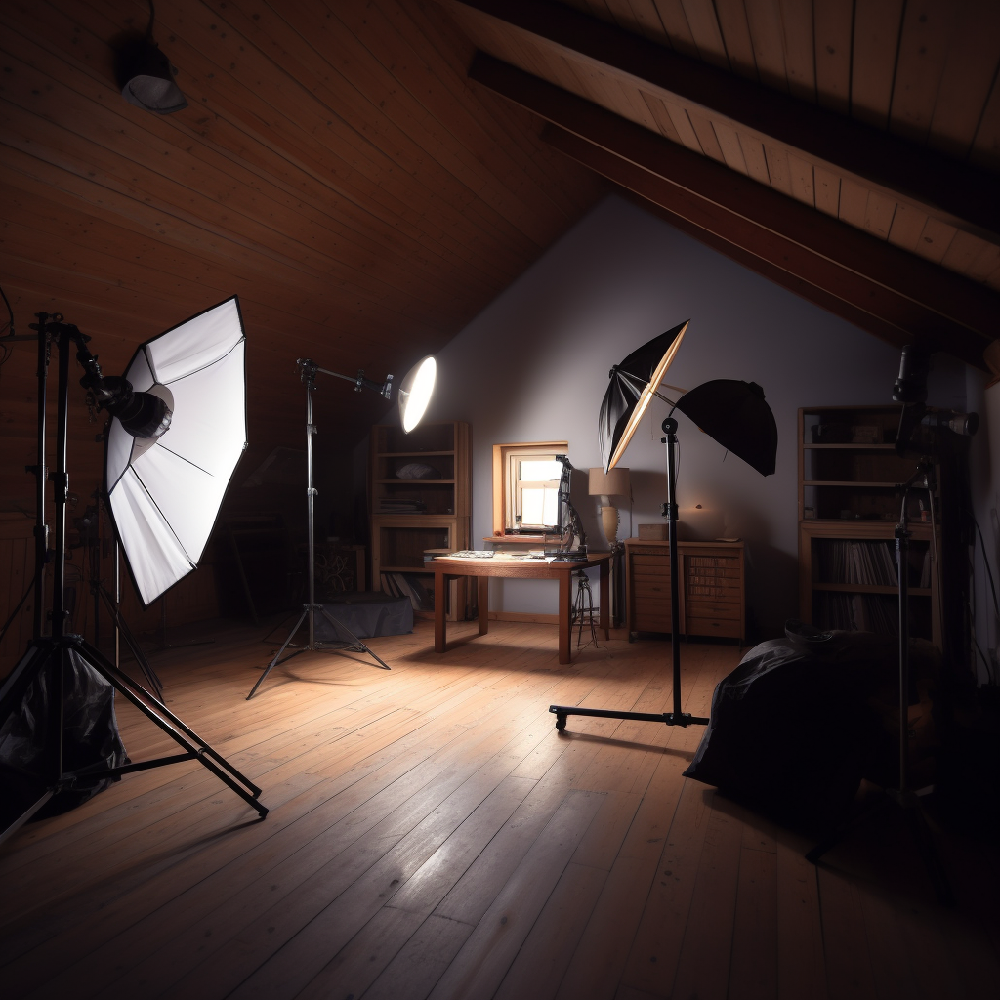      | Studio Lighting          | 工作室燈光。是一種專門用於攝影工作室、電視和電影等領域的照明設計。它將光源和燈具放置在一個專用的攝影工作室中，透過精細的照明來創造出各種不同的氛圍和場景效果，以滿足各種不同的拍攝需求。                                 | Studio lighting 主要應用於商業攝影、時裝攝影、藝術攝影、人像攝影、廣告拍攝、電影和電視製作等領域，目的是透過精細的照明設計來突出主體的特點，達到最佳的拍攝效果。                                                       |
|  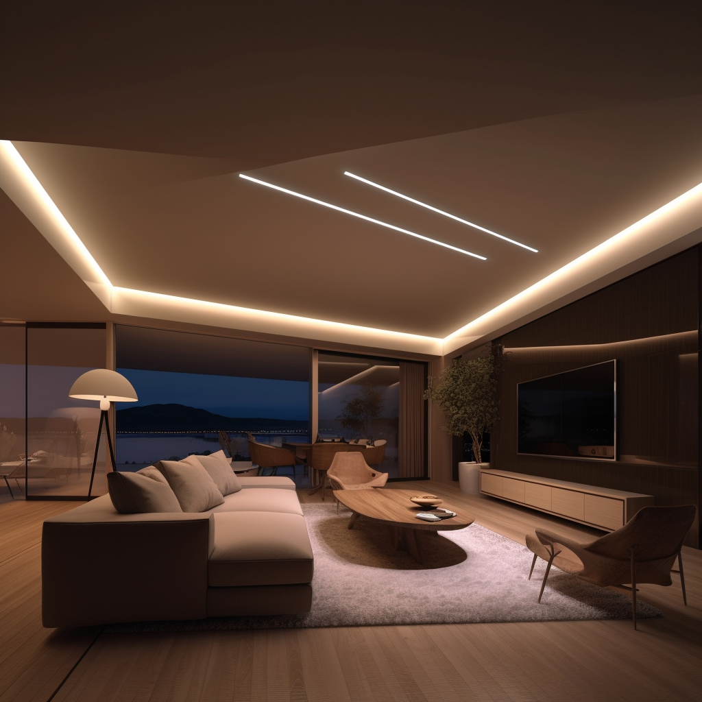      | Cove Lighting            | 壁角燈。是一種常用的室內照明設計，其燈具通常安裝在牆壁或吊頂壁櫥之間的壁角（即『壁櫥』)中，從而營造出舒適、柔和、光滑的環境照明效果。                                                          | 這種照明技術可以為房間提供均勻的光線，同時提高房間的美感和時尚度。                                                                                                              |
|  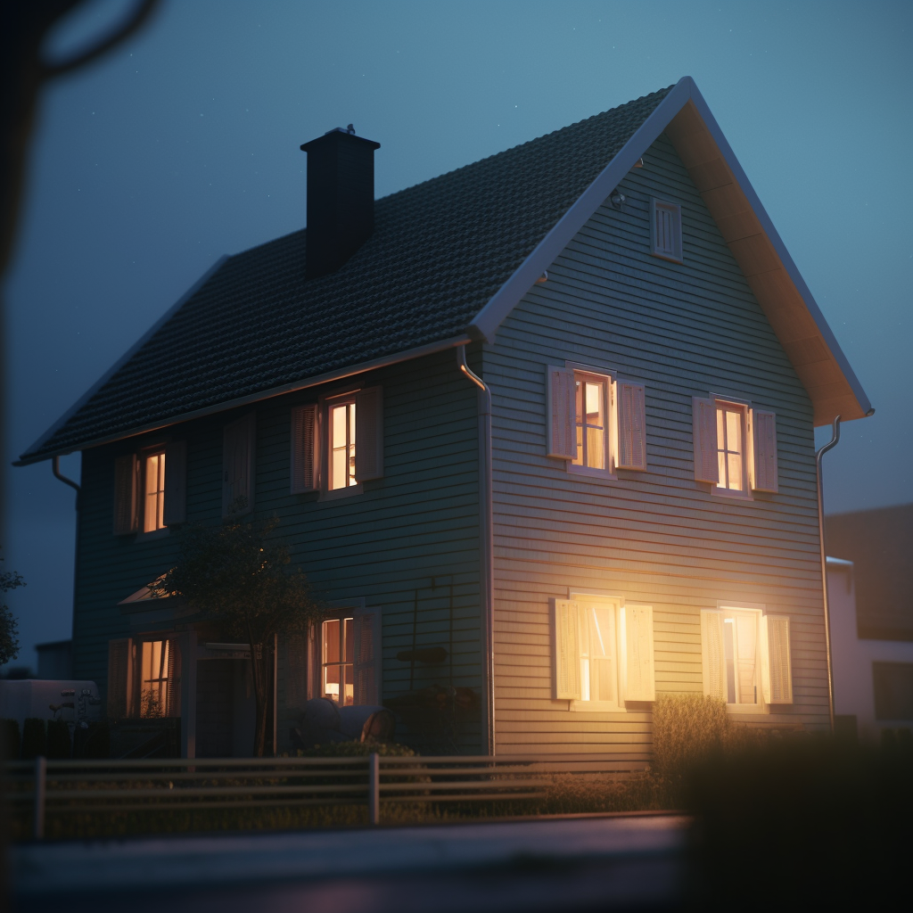      | Soft Lighting            | 柔和照明。是指透過使用柔和、漫射的光線來創造出柔和、溫暖的氛圍效果。柔和的光線通常是透過使用的漫射燈具來實現的，較為常見的是壁燈、檯燈、閱讀燈等。                                                    | 柔和照明效果可以降低照度，減輕視覺疲勞，創造出舒適的氛圍和感覺。                                                                                                               |
|  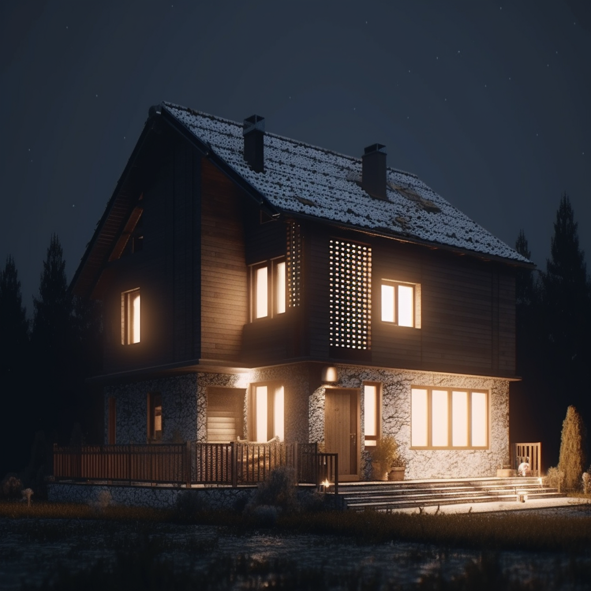      | Hard Lighting            | 硬朗照明。是指透過使用聚光燈、筒燈等燈具來聚焦到一個特定的區域中，其光線是相對集中而直接的。                                                                               | 創造出剛硬、明亮的照明效果。硬朗照明常常用於展示場合，如美術館、商場等環境，以突出展品或商品的特點和質感。                                                                                          |
|  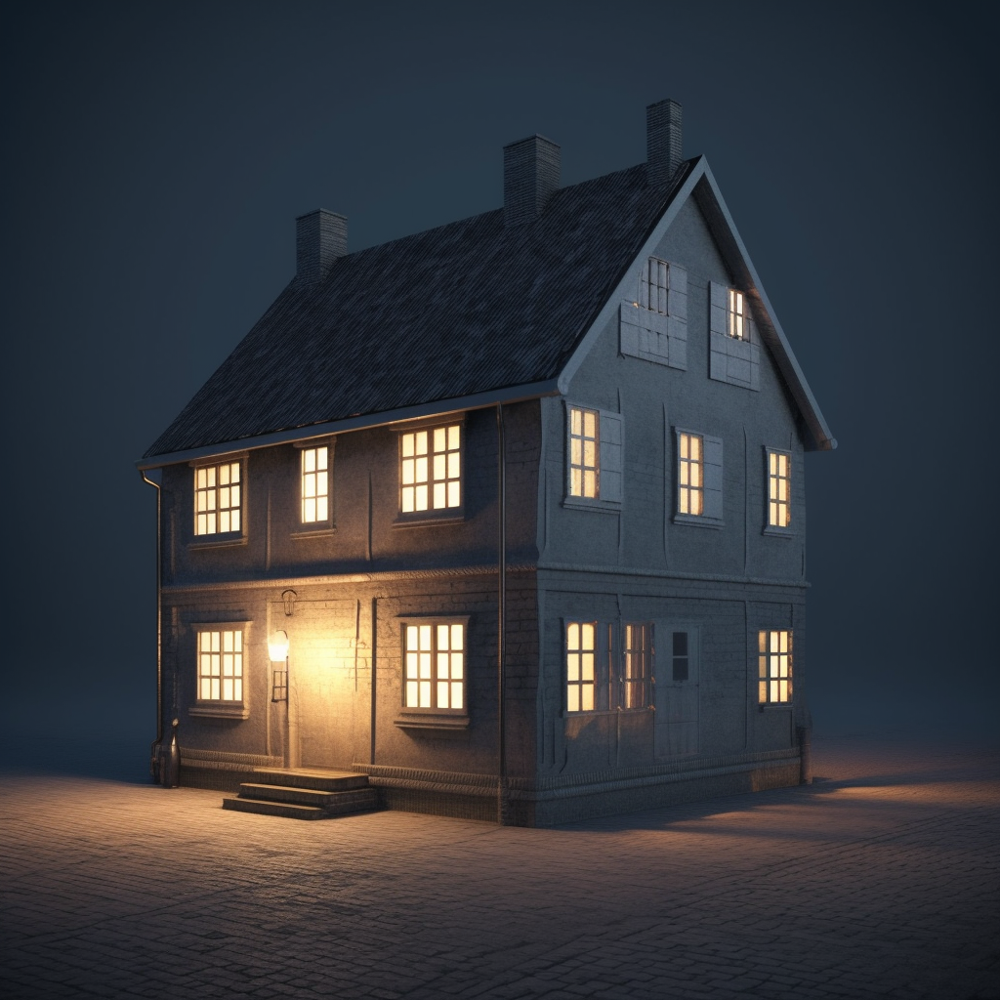      | Volumetric Lighting      | 體積光。是一種創造逼真渲染效果的照明效果技術。它透過在某些場景中新增燈光和各種視覺效果，如擴散、霧、粒子、陰影等，在照明場景中模擬空氣中的粒子和塵埃微粒的現象，從而創造出動態、逼真、增強立體感和體積感的照明效果。                   | 適用於多種場景設計中，如電影、電視、影片遊戲、動畫等領域。它可以讓場景更加逼真、立體，增加場景的緊張度和視覺層次感，並帶來更具有表現力的視覺效果。                                                                      |
|  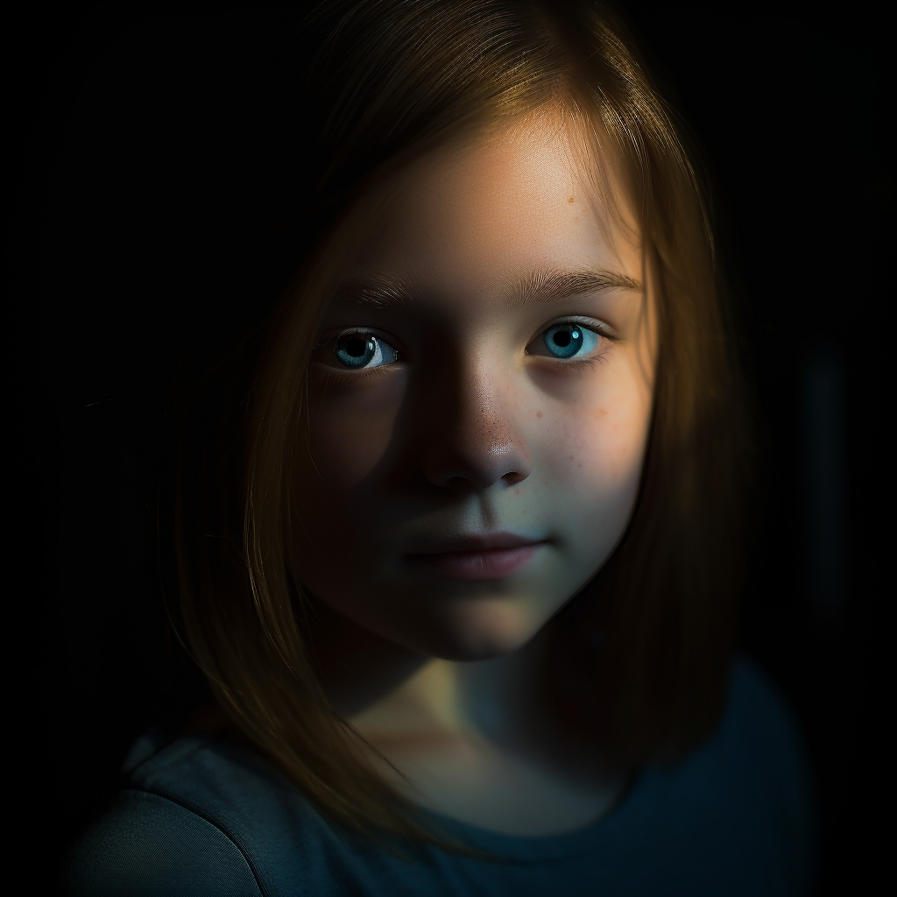      | Low-Key Lighting         | 低鍵照明。指的是一種特殊的照明效果，該效果通常透過強烈的側光或背光和陰影來創造高對比度的畫面效果。低鍵照明的特點是明暗分明、陰影濃重、暗調占主導地位，常常建立一種緊張、神秘或黑暗的氛圍。                                | 低鍵照明廣泛應用於電影、電視、攝影等領域中，常常用來表現懸疑、恐怖、犯罪等要素。                                                                                                       |
|   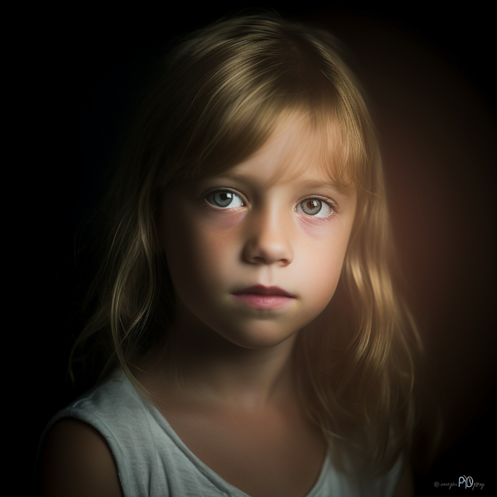     | High-Key Lighting        | 高鍵照明。這種照明效果透過使用明亮、均勻的光線來避免明暗對比並壓低陰影的出現。這種照明效果特點是亮度高、細節豐富，適用於需要傳遞愉悅、輕鬆和開心氛圍的場景和環境。                                            | 高鍵照明通常用於廣告、情感電影、電視劇等中。                                                                                                                         |
|  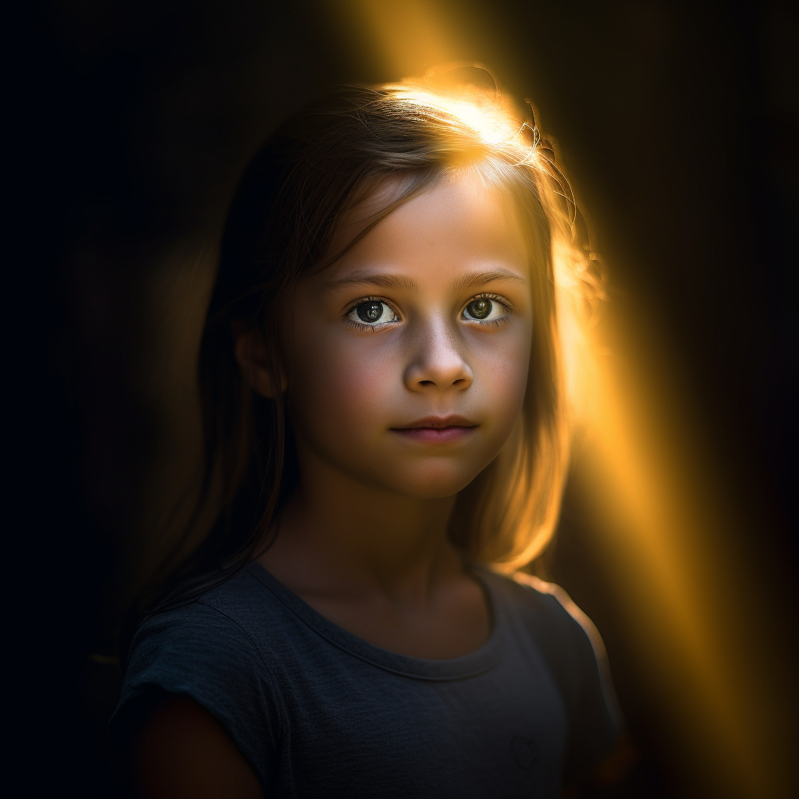      | Epic Light               | 史詩光線。是一種建立極富戲劇性、威嚴感和視覺效果的照明技術，它可以在場景中新增非常亮烈、盛大、壯觀的光線，以吸引觀眾注意力並增加場景的震撼力。                                                      | Epic Light通常用於影視製作、遊戲開發、演出等領域中，以營造出一種崇高、壯麗、宏偉的氛圍，可以使觀眾在看到這些效果時，感到非常震撼和難以忘懷。史詩光線的特點是亮度較高、顏色鮮豔，通常用於表現重要的劇情點，如武器的雷射、宇宙戰爭中的太陽和星星、幻想電影和電子遊戲中的神秘光芒等。 |
|  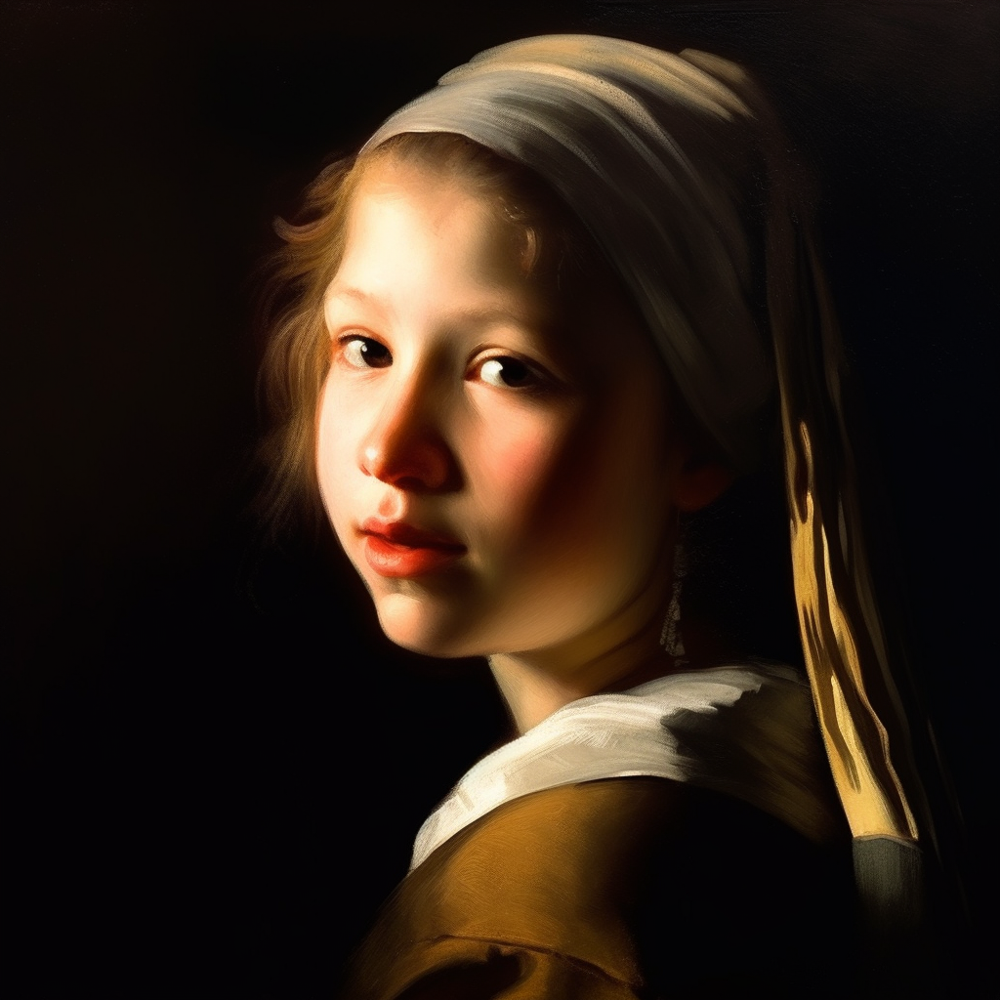      | Rembrandt Lighting       | 林布蘭特特效是一種起源於荷蘭畫家林布蘭特的照明效果，其主要特點是在人物臉部形成一個菱形的明暗分界線，嘴巴和下巴的一側用陰影覆蓋，人物的另一側則被亮光照亮。                                                  | 能營造出一種柔和而神秘的效果。                                                                                                                                |
|  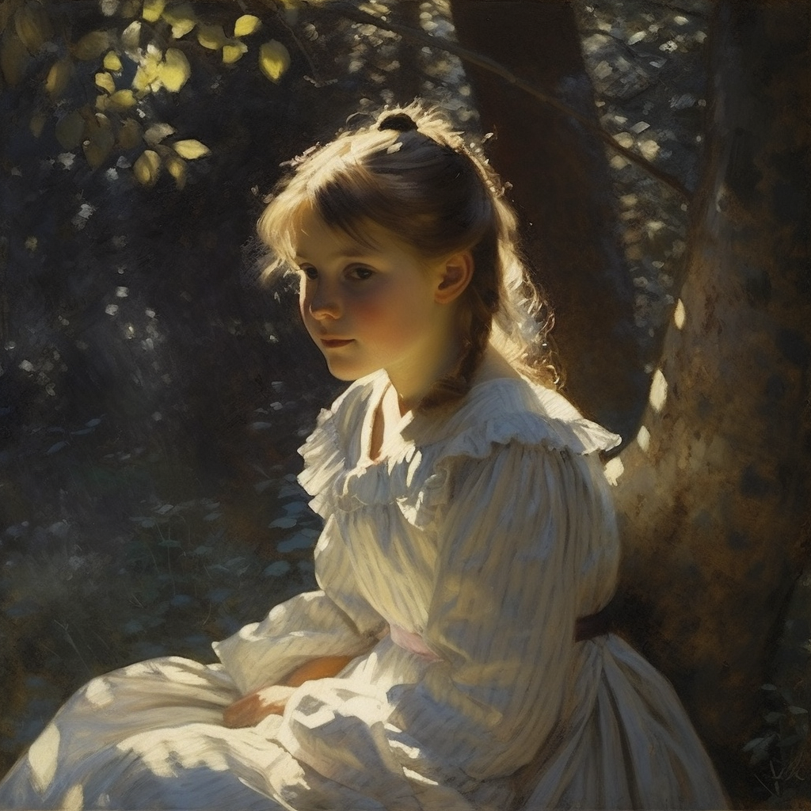      | Contre-Jour              | 逆光照明。指的是攝影師將光源放置在被攝物體的背後，令照射效果在鏡頭前面產生，形成被攝體輪廓明顯的負片形態。                                                                        | 於光源位置造成的暗攝影整體的虛化，高對比度和鮮明的輪廓線可以帶來文藝和抽象的氛圍。                                                                                                      |
|   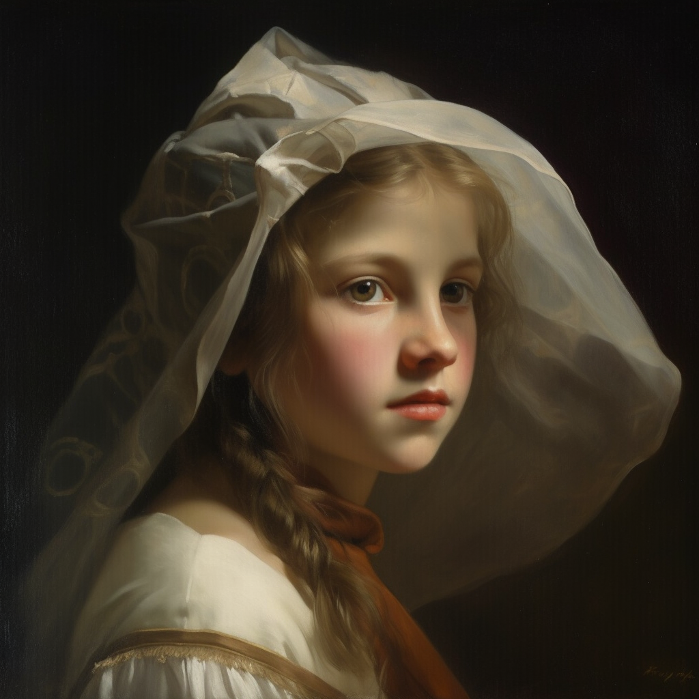     | Veiling Flare            | 透鏡毛玻璃。指當光線從透鏡或鏡頭穿過時，透過玻璃或鏡頭的反光或散射使得影象出現散射光線或最終成像看起來失真的現象。                                                                    |                                                                                                                                                |
|  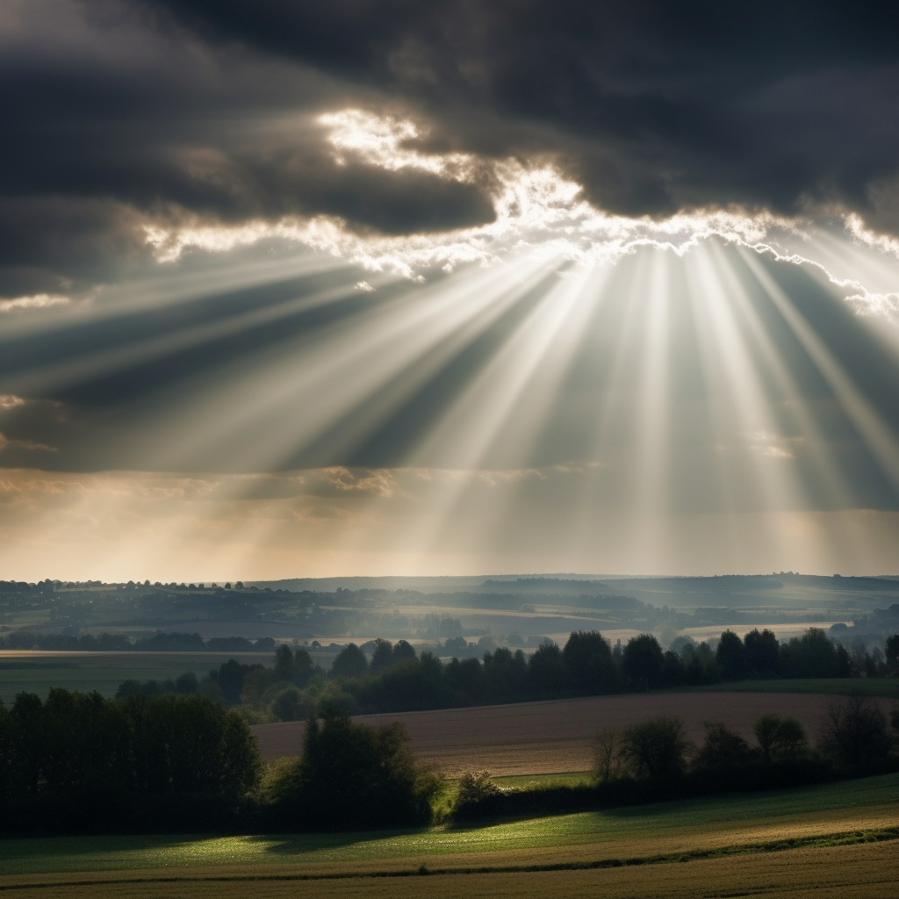      | Crepuscular Rays         | 黎明、黃昏光線。也稱為太陽光柱，是由日光在雲層或塵埃中被反射形成的光線束。因為只有在日出和日落時才有足夠的光線穿過雲層或照射到恰當的夾角，所以Crepuscular Rays通常只出現在日出和日落時刻。                        | Crepuscular Rays通常會在雲層上形成明顯的束狀光線，給人以美麗的感覺。                                                                                                     |
|  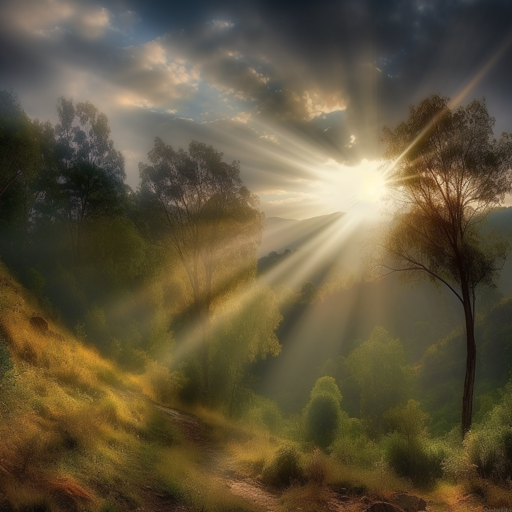      | Rays of Shimmering Light | 閃爍光線。是指在光線散射和折射時出現的光線折射現象。在某些特定的環境下，光線經過不同密度和溫度不同的氣氛，會出現一種光線折射、散射的效果，從而形成閃爍光束效果。                                             |                                                                                                                                                |
|   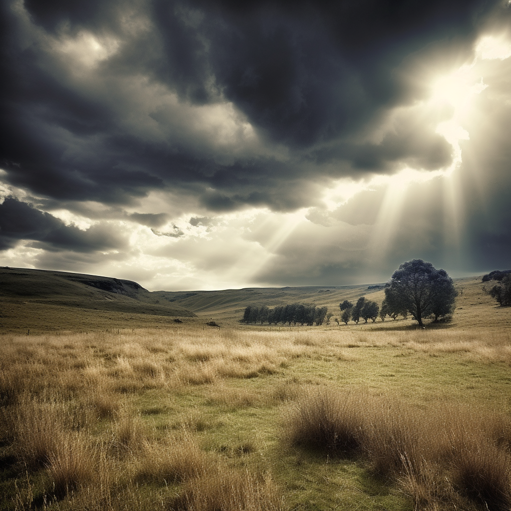     | Godrays                  | 神光。是一種由光線穿過雲朵、樹枝或其他障礙物時，形成的亮光條紋效果。Godrays通常在光線較強的時分出現，將光線分割成條紋狀，形成一種夢幻般的效果，也被稱為 "crepuscular rays" 的一種。                      |                                                                                                                                                |

