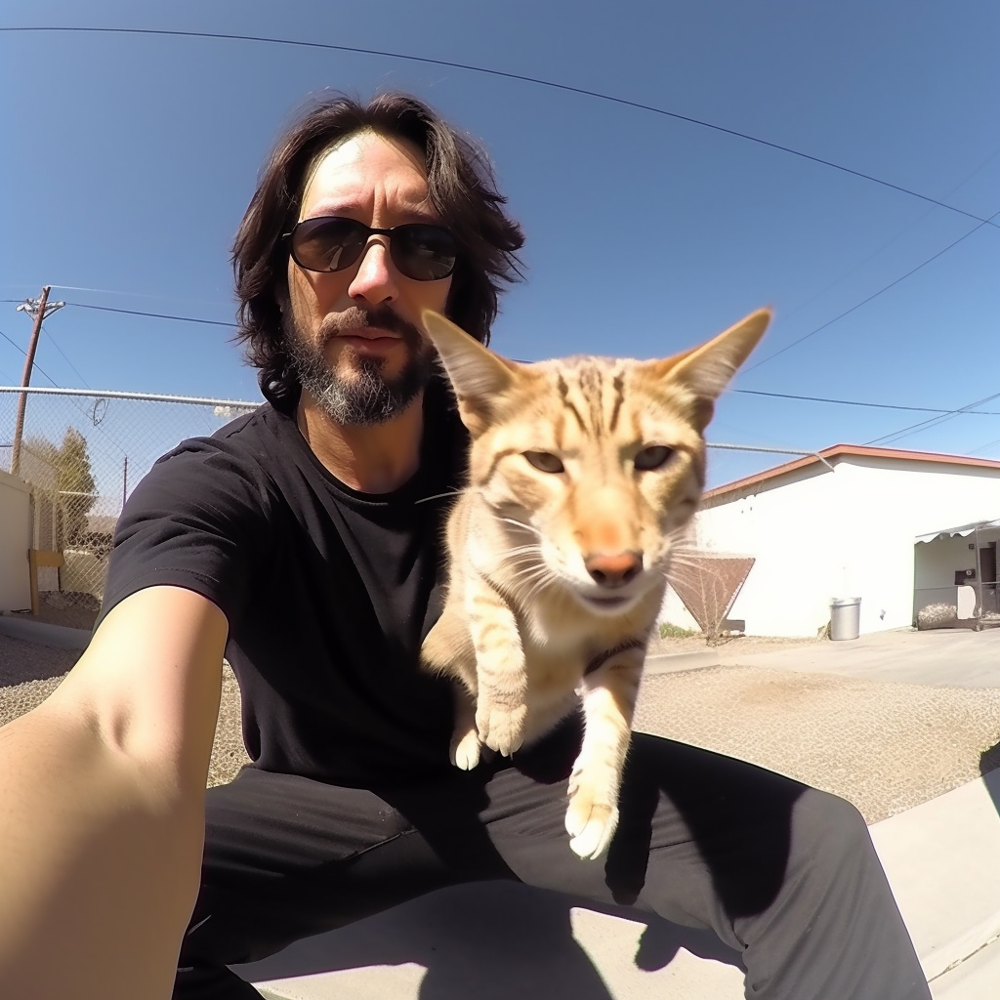
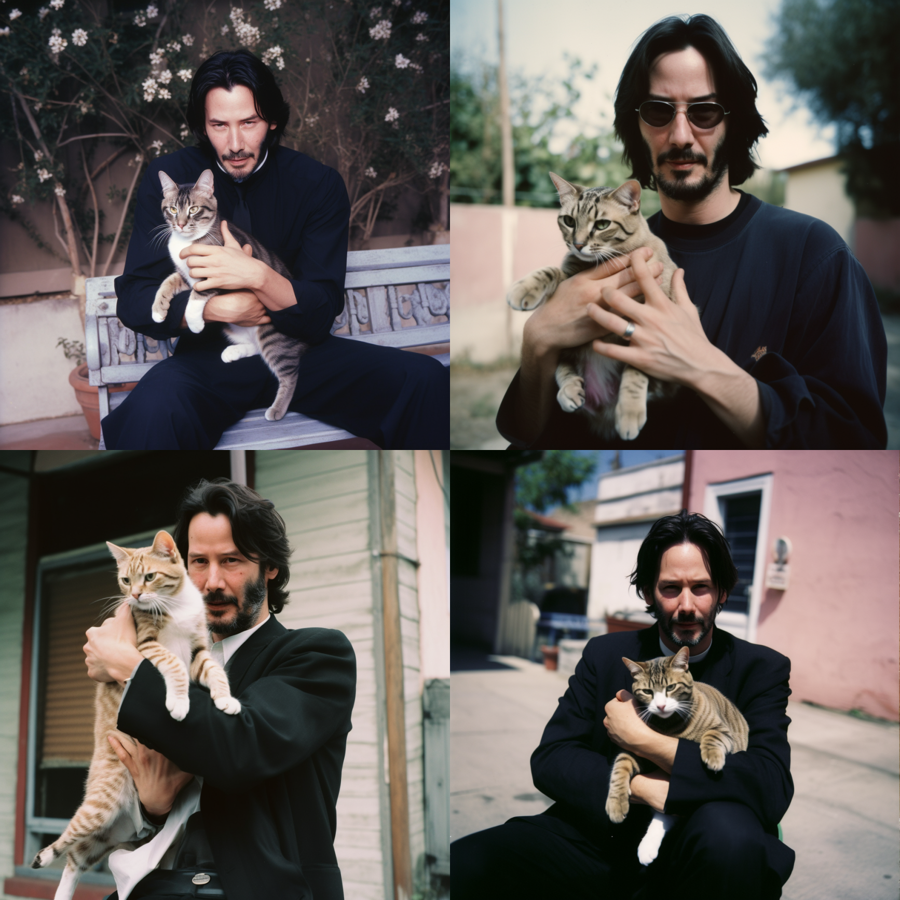
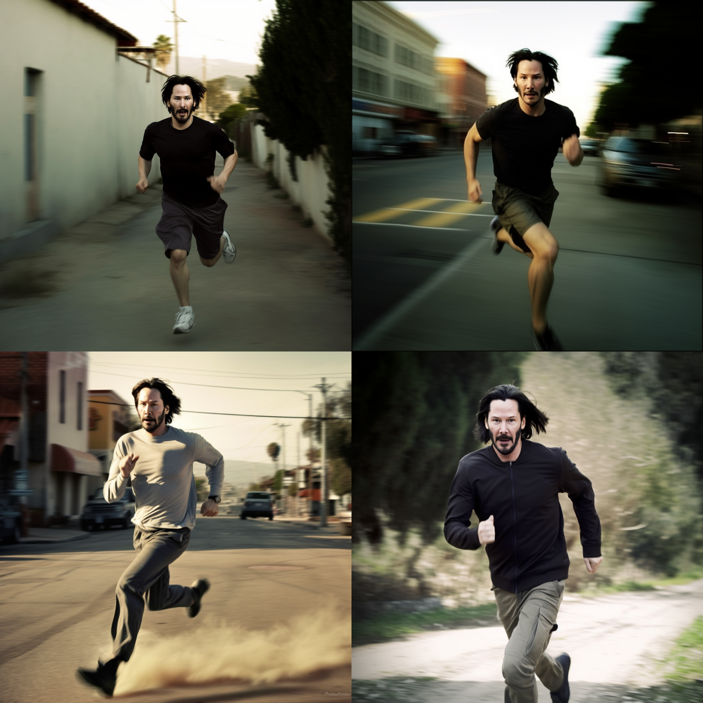
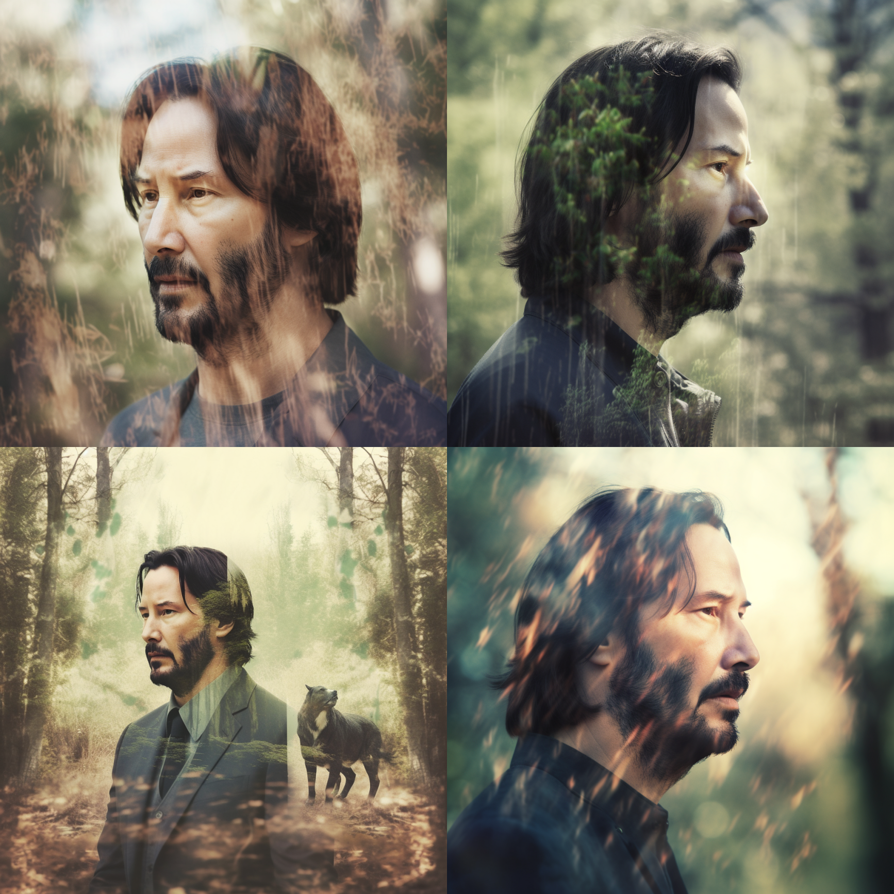
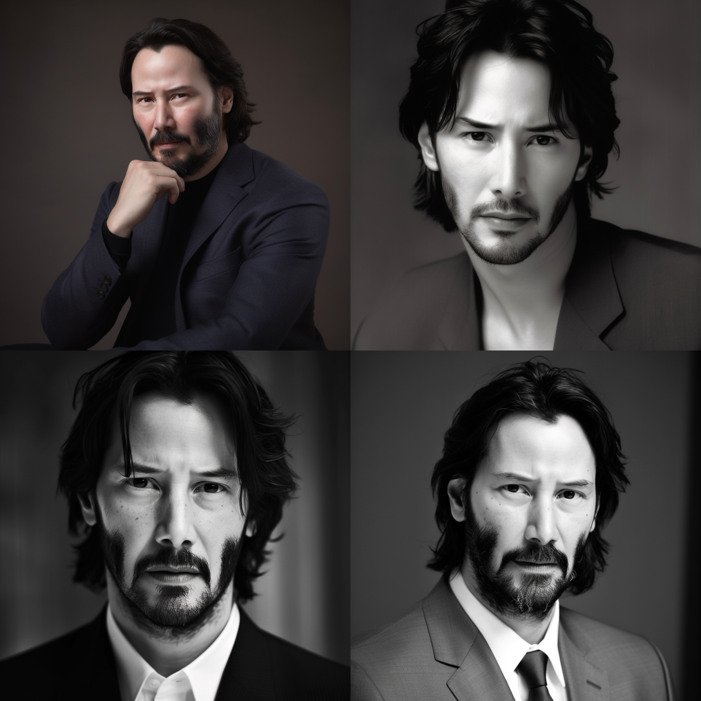
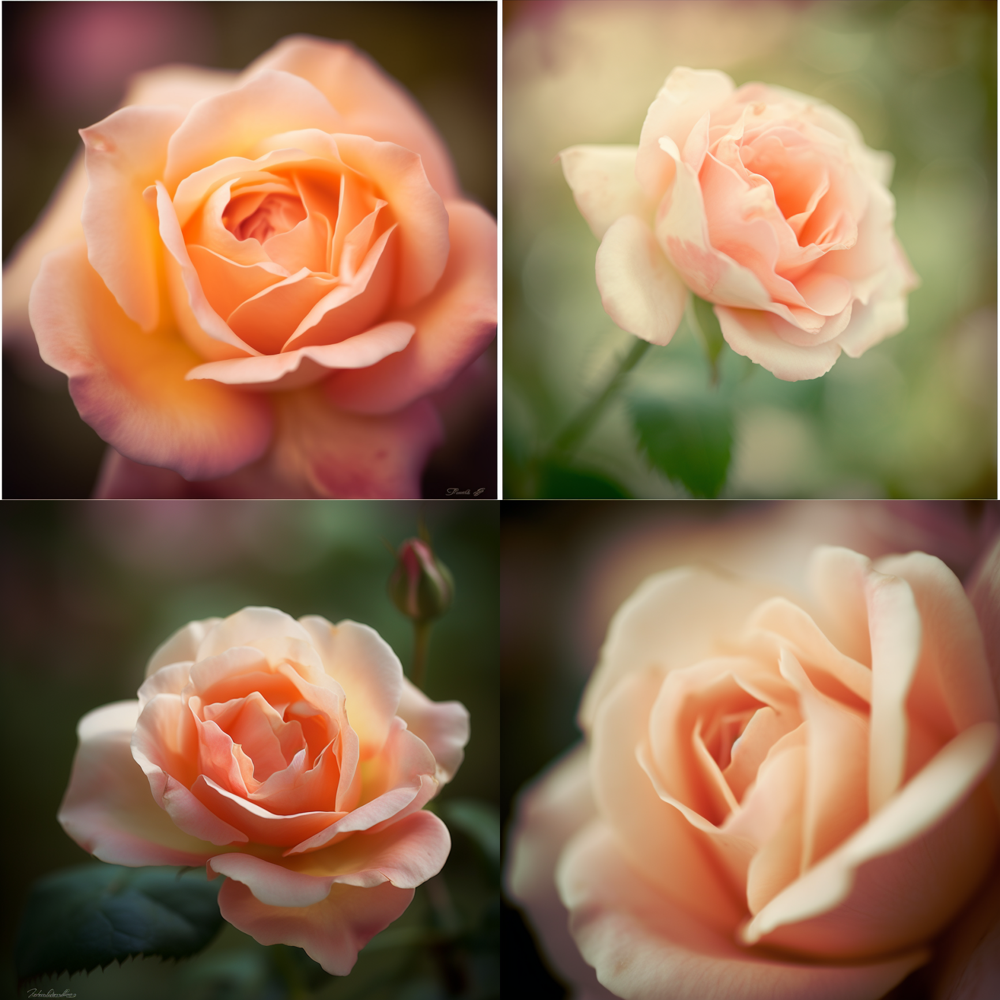
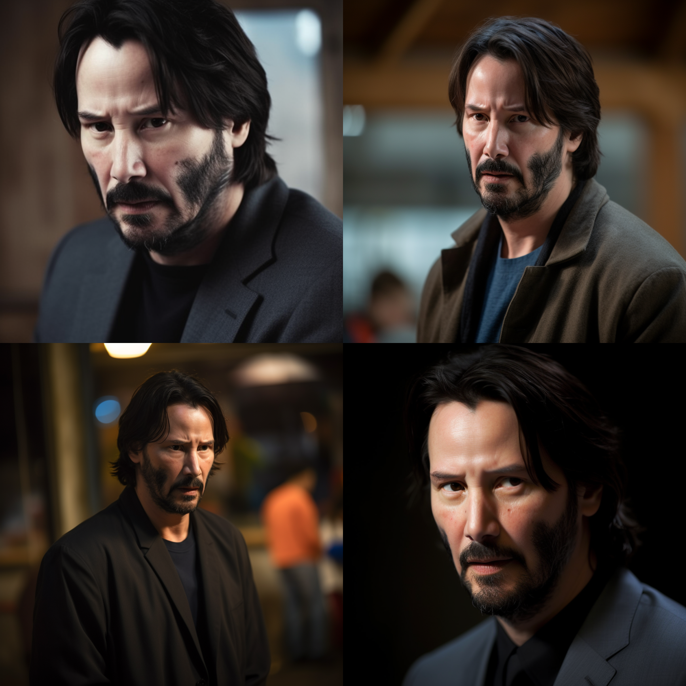

# 場景9：風景

實物和人物介紹完，介紹一下風景。坦率說來，我並不擅長攝影，所以這三章寫得可能會不太專業。我更多地是介紹方法，以及告知大家可能性。

如果有不對的地方，請見諒。

## 微縮景觀

風景大片，我覺得大家應該都在各大平台看過了，所以本章不會介紹太多常見的風景製作方法。而是介紹一些少見的，我這裡介紹一個比較有趣的型別：

|         | **Prompt**        | **解釋**                                                                                             |
| ------- | ----------------- | -------------------------------------------------------------------------------------------------- |
| 型別是什麼？  | Miniature faking  | 迷你化倣效果（Miniature faking），也稱為玩具世界效果，是一種透過特定的拍攝和處理技術來創造出一種縮小的場景感覺的方法。這種技術可以讓實際大小的物件看起來像是一些小的塑料或金屬模型。 |
| 主體是什麼？  | Train Lines       | 火車線路                                                                                               |
| 環境是怎樣的？ | null              | 不太重要，就讓 AI 自由發揮                                                                                    |
| 構圖是怎樣的？ | null              | 不太重要，就讓 AI 自由發揮                                                                                    |
| 用什麼鏡頭？  | null              | 不太重要，就讓 AI 自由發揮                                                                                    |
| 是什麼風格？  | style of Japanese | 我想要那種日本火車style，所以加了這個引數                                                                            |

另外還製作了一個火星工廠：

|        | **Prompt**   | **解釋** |
| ------ | ------------ | ------ |
| 主體是什麼？ | Mars Factory | 火星工廠   |

另外，我還很喜歡用這個效果製作一些多肉植物的照片，主體只要填寫：cute mini Haworthia cymbiformis plant in a pot，或者 cute mini Aloe plant in a pot ：

## 建築

嚴格說來，這個不算風景，但因為我實在不知道該放哪裡，所以還是放到風景這了。

因為我不是建築相關的從業者，所以我這裡只介紹一種用法：對於人造物件，可以在主體里加入由 某某某 製造。以建築為例，也不需要在 prompt 里加型別：

|        | **Prompt**                            | **解釋**                                        |
| ------ | ------------------------------------- | --------------------------------------------- |
| 型別是什麼？ | null                                  | 不太重要，就讓 AI 自由發揮                               |
| 主體是什麼？ | Structure by Dame Zaha Mohammad Hadid | 我的母校香港理工大學設計學院大樓的設計師 Dame Zaha Mohammad Hadid |

右邊是 Frank Gehry：

如果你對建築感興趣，不妨試試兩種風格的建築融合在一起試試，說不定會碰撞出有意思的設計。

## 技巧十六：改變相機與鏡頭

前幾章節分享了燈光，本章分享下，相機和鏡頭。

可能有些朋友用過一些手機 App ，它並不像 PS 工具那樣，允許你修改圖片的白平衡等引數，而是讓你體驗用舊相機（如軟片相機）拍照，雖然本質上來說，它也是透過各種引數來模擬當年的相機效果，但的確挺有意思的。

在 Midjourney 裡，你也可以透過增加相機或者鏡頭的名稱，從而達到類似的效果。根據我的實驗，Midjourney 可以改變以下幾類：

1. 相機：支援不同種類的相機，比如運動相機 GoPro
2. 軟片：比如 8 mm 電影軟片
3. 鏡頭：比如 15 mm 鏡頭
4. 相機設定：比如長曝光、雙重曝光
5. 景深 & 焦點：比如深景、淺景，還有消失點

我很喜歡雙重曝光的效果，以及長曝光：

不過各位使用時，需要根據自己的場景選擇合適的相機和鏡頭，比如無人機視角，都不太適合拍近物：

|
**照片**
 | **名稱**               | **介紹**                         | **適合場景**                                                                                                                                                   |
| ------ | -------------------- | ------------------------------ | ---------------------------------------------------------------------------------------------------------------------------------------------------------- |
|        | GoPro                | 運動相機視角                         | 自拍，或者運動場景                                                                                                                                                  |
|        | Drone                | 無人機視角                          | 適合航拍，或者天空景色                                                                                                                                                |
|        | polaroid             | 寶麗來                            | 應該不需要解釋了吧                                                                                                                                                  |
|        | black and white film | 黑白照                            | 應該不需要解釋了吧                                                                                                                                                  |
|        | Kodachrome           | 柯達生產的彩色幻燈片底片品牌                 | 具有非常高的顏色鮮豔度、對比度和持久性。                                                                                                                                       |
|        | shot on 8mm          | 電影 8 毫米軟片是一種攜帶型、簡單易用的膠片，解析度比較低 | 適用於拍攝家庭和旅遊等普通場景                                                                                                                                            |
|        | shot on 16mm         | 電影 16 毫米軟片                     | 16毫米和35毫米主要用於製作電影、記錄片和商業廣告。                                                                                                                                |
|        | shot on 35mm         | 電影 35 毫米軟片                     | 16毫米和35毫米主要用於製作電影、記錄片和商業廣告。                                                                                                                                |
|        | Microscopic          | 顯微鏡                            | 適合一些需要放大觀察的實物                                                                                                                                              |
|        | Fisheye Lens         | 魚眼鏡頭                           | 魚眼鏡頭可以將整個場景拍攝在一個範圍內，這種鏡頭的視角通常在 100° 至 180° 之間，可以呈現出非常誇張的透視效果。                                                                                              |
|        | Wide Angle           | 廣角鏡頭                           | 適合風景照，可以讓畫面容納更多內容                                                                                                                                          |
|        | Ultra-Wide Angle     | 超廣鏡頭                           | 適合風景照，可以讓畫面容納更多內容                                                                                                                                          |
|        | Panorama             | 全景                             | 適合風景照，可以讓畫面容納更多內容                                                                                                                                          |
|        | Short Exposure       | 短曝光                            | 通常用於追拍運動員、表演者或動物等，或者是拍攝需要快速決定瞬間捕捉的場景，例如拍攝火車、汽車、快速移動的車輛等。由於短曝光時間的限制，這種方式可以凍結運動物體並防止出現模糊的情況。                                                                 |
|        | Long Exposure        | 長曝光                            | 在長曝光的拍攝中，快速移動的物體會出現軌跡，例如流星、車燈、瀑布等，這種方式會給照片創造出愉悅而神秘的氛圍。此外，長曝光可以用於拍攝夜晚的大片景象，例如景色、城市夜景、星空等。                                                                   |
|        | Double Exposure      | 雙重曝光                           | 雙重曝光的技術，可以創造出疏密有致和扭曲的、手繪和黑白藝術風格的照片。這種技術在拍攝人像、風景和建築等領域十分受歡迎，因為它可以創造出獨特的環境、浪漫和奇異感覺的影象。                                                                       |
|        | f2.8                 | 2.8 光圈                         | 在拍攝時，光圈值越大，相應的光線進入相機的量就越大，使得相機所獲得的影象更亮。f:2.8 的值是一個比較大的光圈值，因此鏡頭具有很高的傳光能力，適合在低光環境中使用。同時，在大光圈下可以創造出較小的景深效果，突出焦點主題而模糊背景或前景，從而產生輕柔的背景效果，適合拍攝人物肖像或商品照片等類似主題。 |
|        | Depth of Field       | 景深                             | 是指在攝影中，被拍攝的畫面中被認為是清晰的範圍，也稱為焦距深度區域，通常用來描述在照片中被認為是清晰的範圍。                                                                                                     |
|        | Soft Focus           | 柔焦                             | 指將相機鏡頭前加入一層特殊的濾鏡，使被拍攝的主體輕微模糊以呈現柔和的美感效果。柔焦的視覺效果相較於深景和淺景來說更強調畫面的情感主題，把重點集中在逐漸化解結構感的質感效果上，使它在照片上產生一種有點朦朧的妝容，刻劃出一幅浪漫的畫面。                                       |
|        | Deep Focus           | 深焦                             | 將攝像頭在一個較大的光圈下設定，保持整個畫面都清晰銳利的技術。深景通常需要使用較小的焦距或較遠的拍攝距離，以保持整個畫面的清晰度，是類似於大景深的一種刻劃效果。                                                                           |
|        | Shallow Focus        | 淺焦                             | 將相機的光圈調整到一個相對較大的開口，以使攝影師可以根據需要保持相機在平面上的一個特定區域或主體清晰，而照片中的其他區域則變得模糊不清的技術。這種效果常用於攝影肖像，使人物在畫面上的清晰度突出，並且畫面背景透露輕微的模糊感，帶來更具藝術美感的效果。                               |
|        | Vanishing Point      | 消失點                            | 消失點指的是位於無窮遠處，用於視覺處理的一點。在透視繪畫中，我們可以想象一個位於無窮遠處的點，使得所有線條都向它聚攏。消失點可以幫助畫家或攝影師達到精緻的透視處理效果，從而創造出獨特的空間感；                                                           |
|        | Vantage Point        | 俯瞰視角                           | 一般呈現的效果是照片中會有一個點是最高點，然後在此最高點斜上方拍攝                                                                                                                          |

