# 技巧十三：善用燈光

坦誠地跟大家說，我不是設計師，也不是攝影師（而且我非常不擅長攝影），所以我僅能跟大家分享一下基礎內容，因為這個對我來說，太多過程性知識了，不實際操作過，根本不知道有什麼。

言歸正傳，攝影中，常用攝影燈光有以下幾種：

1. 主燈 (Key Light)：主燈是最基本的攝影燈光之一，通常放置在被拍攝物體的正前方或正側方，用於照明主體，決定拍攝物體的主要明暗度。主燈通常是亮度最高的燈光。
2. 填光燈 (Fill Light)：填光燈用於彌補主燈照射的陰影部分，調整陰影的深淺程度，使照片明亮一些。通常填充光應該比主光暗一些，以避免出現過度曝光。
3. 逆光燈 (Back Light)：逆光燈用於照射被拍攝物體的背面，能夠區別出主體和背景，並使物體輪廓變得清晰，常用於拍攝骨感、重物感和逆光效果的照片等。
4. 環境光 (Ambient Light)：環境光就是攝影環境自然產生的光線，包括室內照明、自然光、街燈等，它可以補充被拍攝物體的表面，提升照片的自然度和真實感。
5. 故事性燈光 (Special Light)：通常是為了製造出某種情境或者表達某種意義而使用的，例如燭光、亮光等。它們能夠產生溫暖、浪漫、神秘等場景和氣氛，以探索和表達藝術的想象力和創造力。

基於這些燈進行排列組合，你會得到不同使用場景的燈光。燈光的細節種類，可以去我歸納的 Lighting List 裡檢視，我這裡主要分享一些常用和易用的場景燈光：

| 
**照片**
 | **名稱**                   | **介紹**                                                                                                                       | **適合場景**                                                                                                                                       |
| ------ | ------------------------ | ---------------------------------------------------------------------------------------------------------------------------- | -------------------------------------------------------------------------------------------------------- |
|  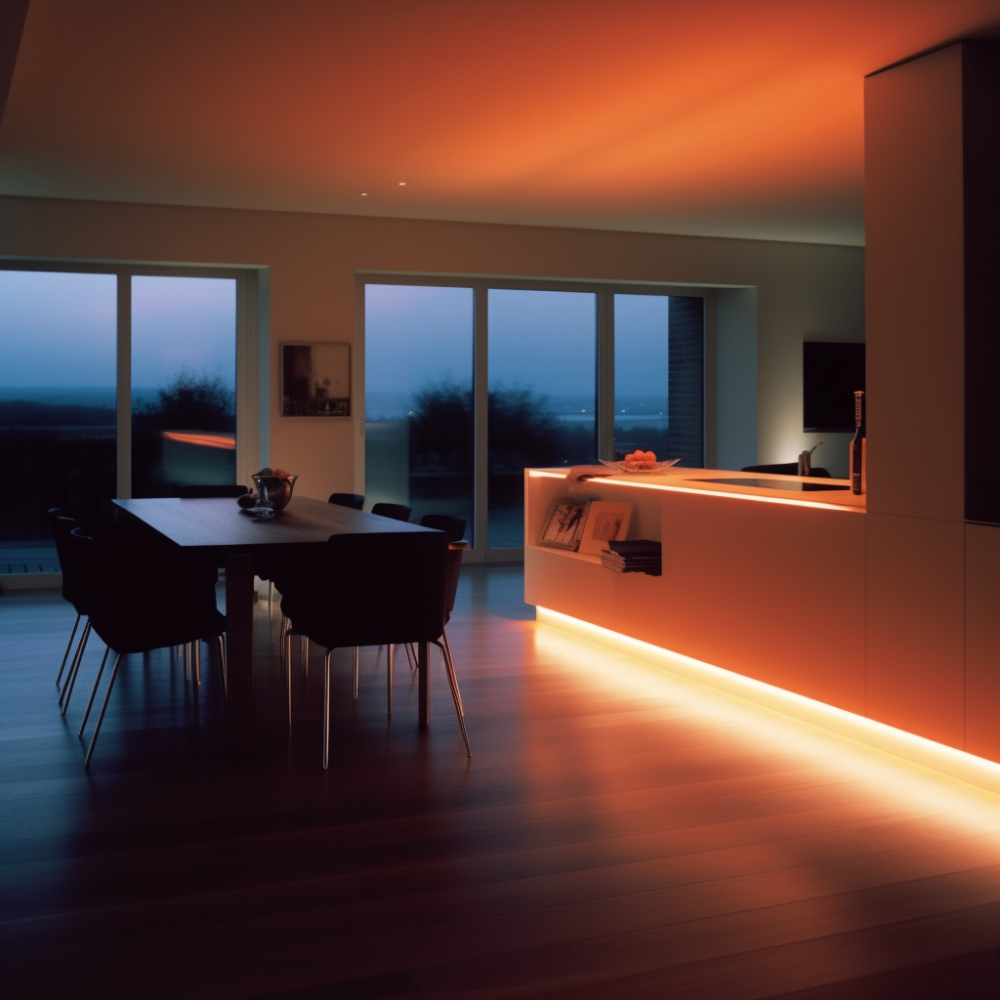    | Mood Lighting            | 氛圍燈。主要是透過在特定的環境中改變燈光的顏色和亮度等引數來創造一種特定的氛圍，以營造舒適、浪漫、放鬆等感覺。從技術實現上看，Mood lighting則著重於燈光的顏色和亮度控制，注重創造強烈的視覺效果。                  | Mood lighting通常用於室內設計、酒店、餐廳及居家裝飾等領域，旨在創造出一種特定的氣氛和體驗。                                                                                           |
|  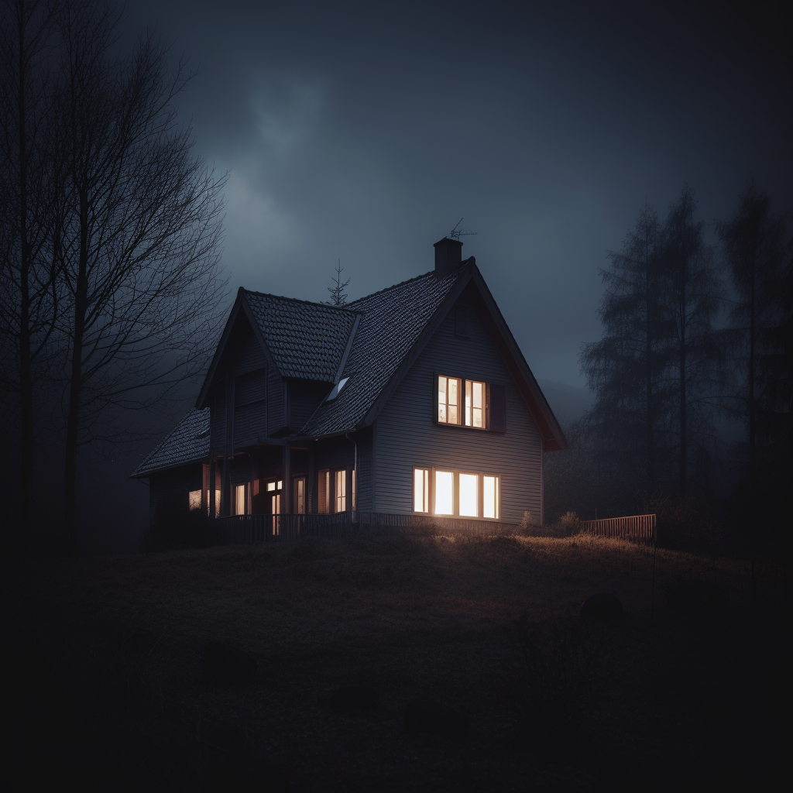     | Moody Lighting           | 情緒燈。它更強調在情感表達和為故事情節服務方面的應用，設計的目的是要把燈光與劇情完美結合起來，以展現角色的個性和情感世界。從技術實現上看，Moody lighting通常採用低亮度和大比例遮擋陰影，強調暗部的掃描，以增加畫面的紋理和層次感。 | Moody lighting通常用於影視製作、遊戲介面、舞台表演等領域，設計的目的是為了增加故事情節的戲劇效果。                                                                                       |
|  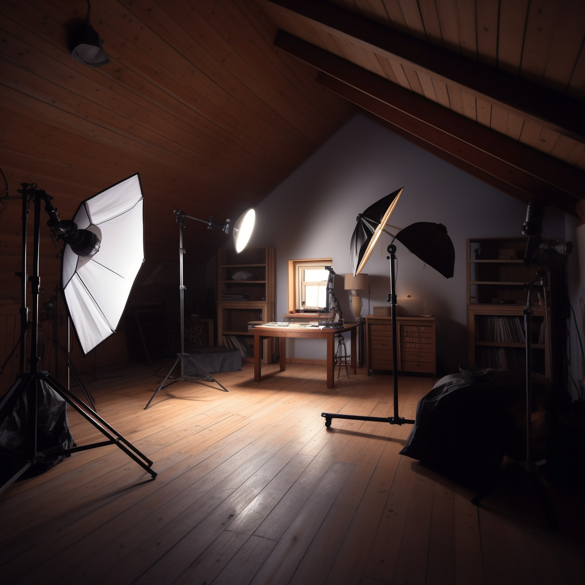      | Studio Lighting          | 工作室燈光。是一種專門用於攝影工作室、電視和電影等領域的照明設計。它將光源和燈具放置在一個專用的攝影工作室中，透過精細的照明來創造出各種不同的氛圍和場景效果，以滿足各種不同的拍攝需求。                                 | Studio lighting 主要應用於商業攝影、時裝攝影、藝術攝影、人像攝影、廣告拍攝、電影和電視製作等領域，目的是透過精細的照明設計來突出主體的特點，達到最佳的拍攝效果。                                                       |
|  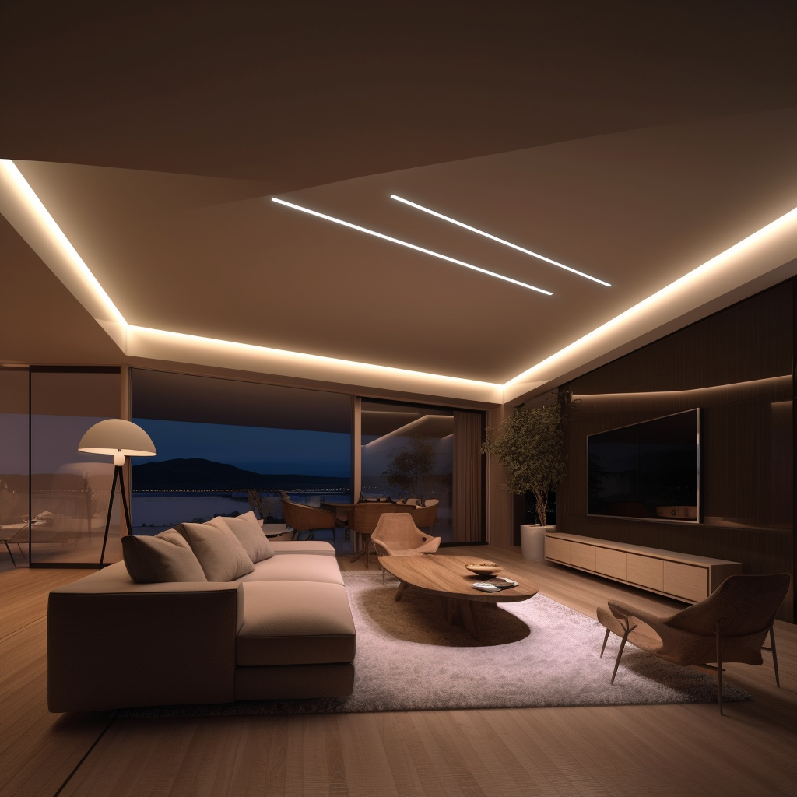      | Cove Lighting            | 壁角燈。是一種常用的室內照明設計，其燈具通常安裝在牆壁或吊頂壁櫥之間的壁角（即『壁櫥』)中，從而營造出舒適、柔和、光滑的環境照明效果。                                                          | 這種照明技術可以為房間提供均勻的光線，同時提高房間的美感和時尚度。                                                                                                              |
|  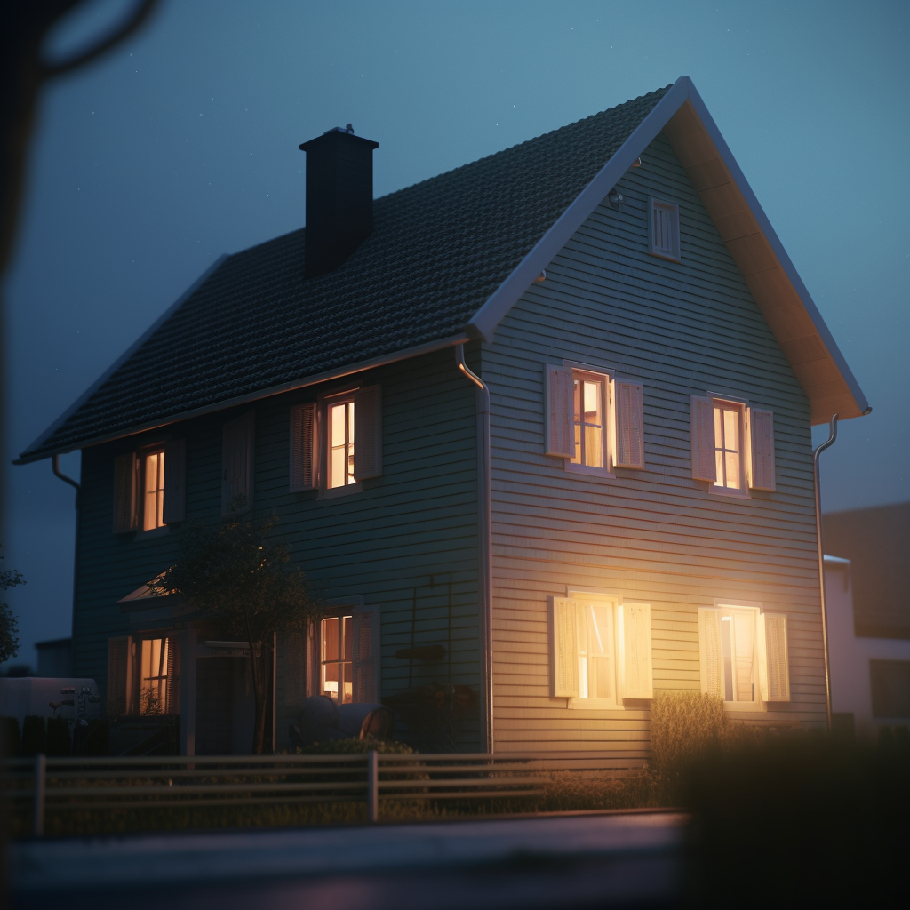      | Soft Lighting            | 柔和照明。是指透過使用柔和、漫射的光線來創造出柔和、溫暖的氛圍效果。柔和的光線通常是透過使用的漫射燈具來實現的，較為常見的是壁燈、檯燈、閱讀燈等。                                                    | 柔和照明效果可以降低照度，減輕視覺疲勞，創造出舒適的氛圍和感覺。                                                                                                               |
|        | Hard Lighting            | 硬朗照明。是指透過使用聚光燈、筒燈等燈具來聚焦到一個特定的區域中，其光線是相對集中而直接的。                                                                               | 創造出剛硬、明亮的照明效果。硬朗照明常常用於展示場合，如美術館、商場等環境，以突出展品或商品的特點和質感。                                                                                          |
|  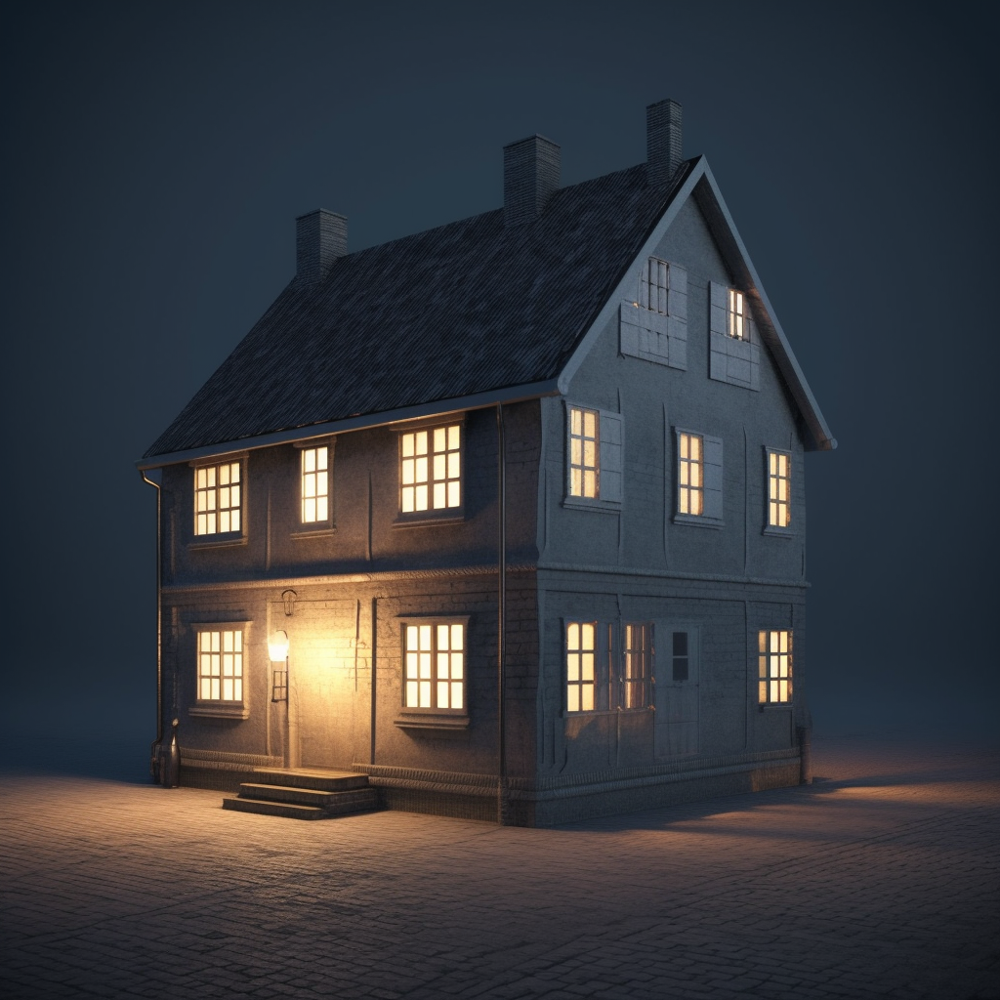      | Volumetric Lighting      | 體積光。是一種創造逼真渲染效果的照明效果技術。它透過在某些場景中新增燈光和各種視覺效果，如擴散、霧、粒子、陰影等，在照明場景中模擬空氣中的粒子和塵埃微粒的現象，從而創造出動態、逼真、增強立體感和體積感的照明效果。                   | 適用於多種場景設計中，如電影、電視、影片遊戲、動畫等領域。它可以讓場景更加逼真、立體，增加場景的緊張度和視覺層次感，並帶來更具有表現力的視覺效果。                                                                      |
|  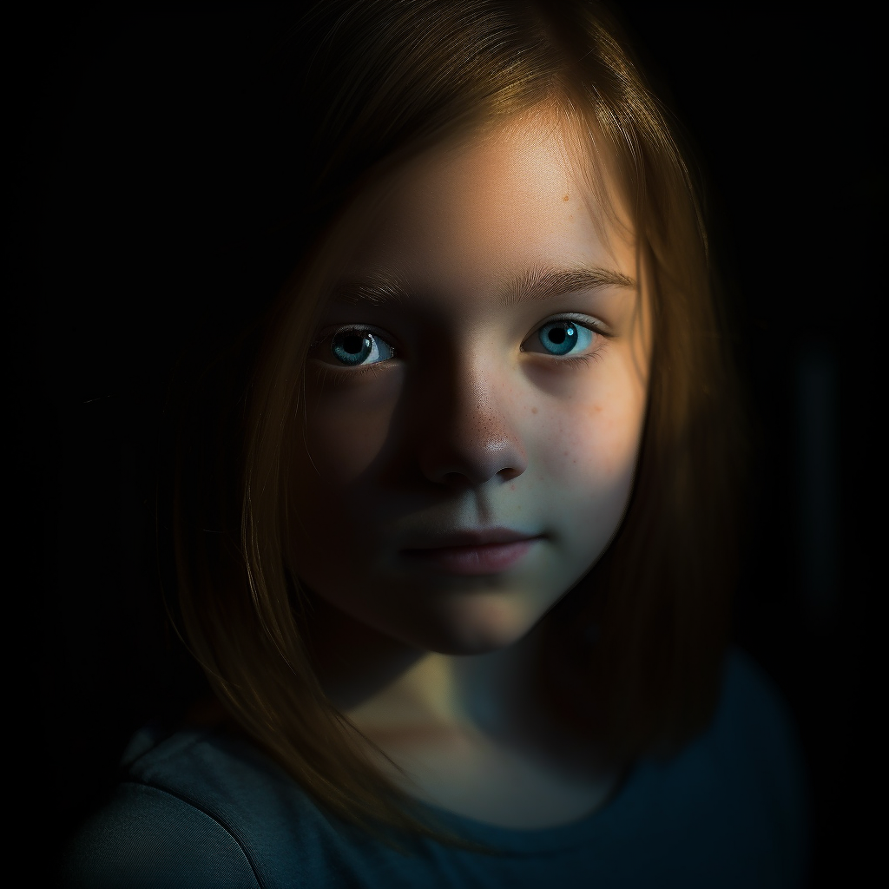      | Low-Key Lighting         | 低鍵照明。指的是一種特殊的照明效果，該效果通常透過強烈的側光或背光和陰影來創造高對比度的畫面效果。低鍵照明的特點是明暗分明、陰影濃重、暗調占主導地位，常常建立一種緊張、神秘或黑暗的氛圍。                                | 低鍵照明廣泛應用於電影、電視、攝影等領域中，常常用來表現懸疑、恐怖、犯罪等要素。                                                                                                       |
|   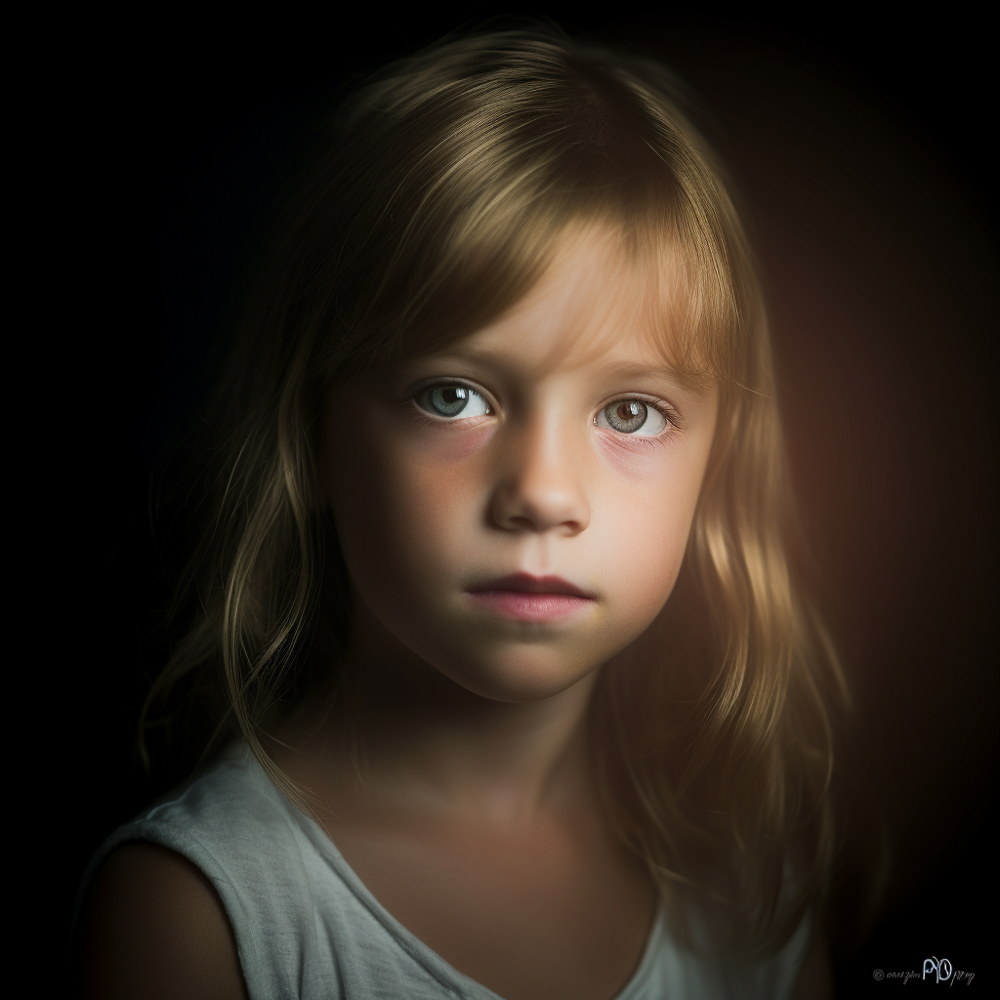     | High-Key Lighting        | 高鍵照明。這種照明效果透過使用明亮、均勻的光線來避免明暗對比並壓低陰影的出現。這種照明效果特點是亮度高、細節豐富，適用於需要傳遞愉悅、輕鬆和開心氛圍的場景和環境。                                            | 高鍵照明通常用於廣告、情感電影、電視劇等中。                                                                                                                         |
|  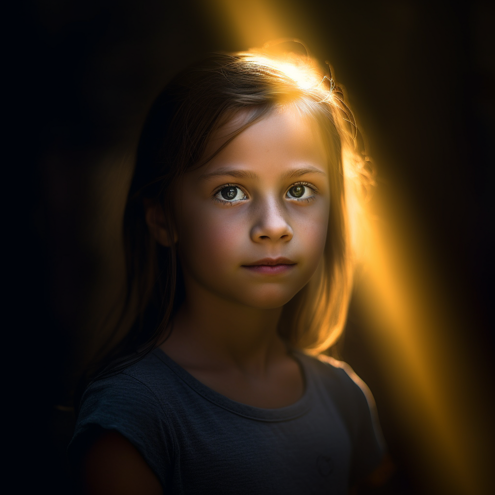      | Epic Light               | 史詩光線。是一種建立極富戲劇性、威嚴感和視覺效果的照明技術，它可以在場景中新增非常亮烈、盛大、壯觀的光線，以吸引觀眾注意力並增加場景的震撼力。                                                      | Epic Light通常用於影視製作、遊戲開發、演出等領域中，以營造出一種崇高、壯麗、宏偉的氛圍，可以使觀眾在看到這些效果時，感到非常震撼和難以忘懷。史詩光線的特點是亮度較高、顏色鮮豔，通常用於表現重要的劇情點，如武器的雷射、宇宙戰爭中的太陽和星星、幻想電影和電子遊戲中的神秘光芒等。 |
|  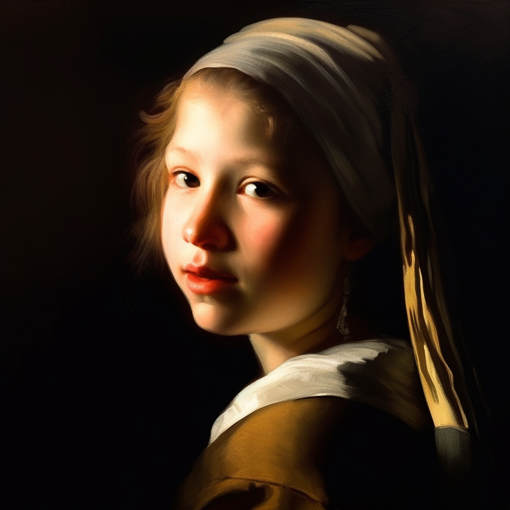      | Rembrandt Lighting       | 林布蘭特特效是一種起源於荷蘭畫家林布蘭特的照明效果，其主要特點是在人物臉部形成一個菱形的明暗分界線，嘴巴和下巴的一側用陰影覆蓋，人物的另一側則被亮光照亮。                                                  | 能營造出一種柔和而神秘的效果。                                                                                                                                |
|  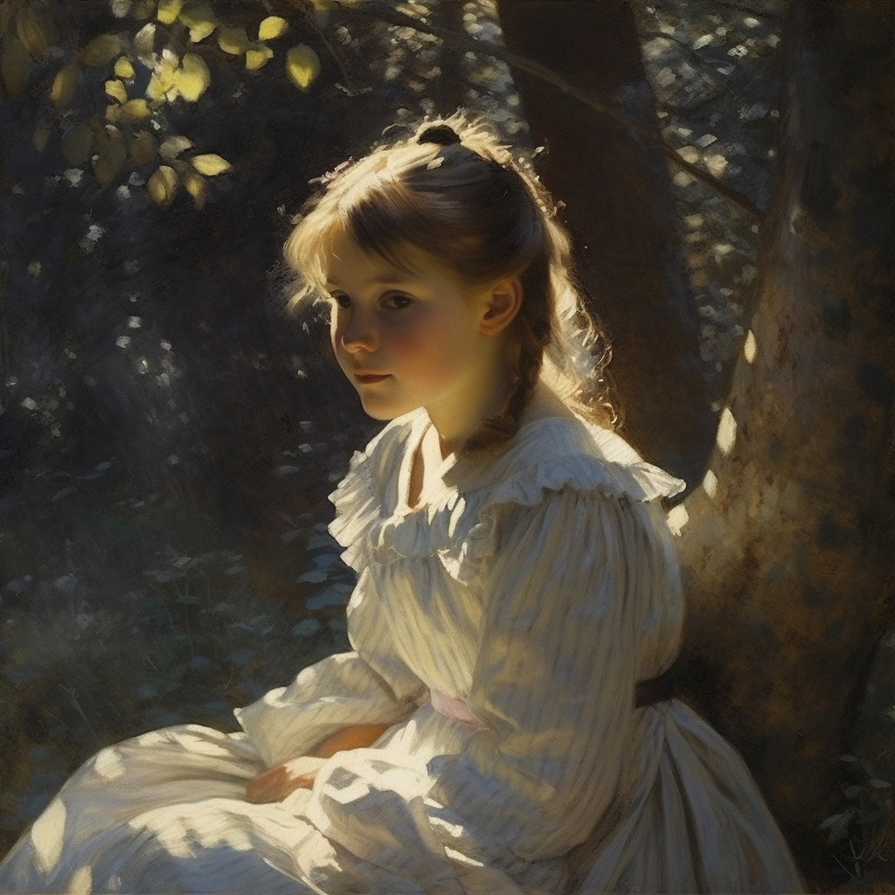      | Contre-Jour              | 逆光照明。指的是攝影師將光源放置在被攝物體的背後，令照射效果在鏡頭前面產生，形成被攝體輪廓明顯的負片形態。                                                                        | 於光源位置造成的暗攝影整體的虛化，高對比度和鮮明的輪廓線可以帶來文藝和抽象的氛圍。                                                                                                      |
|   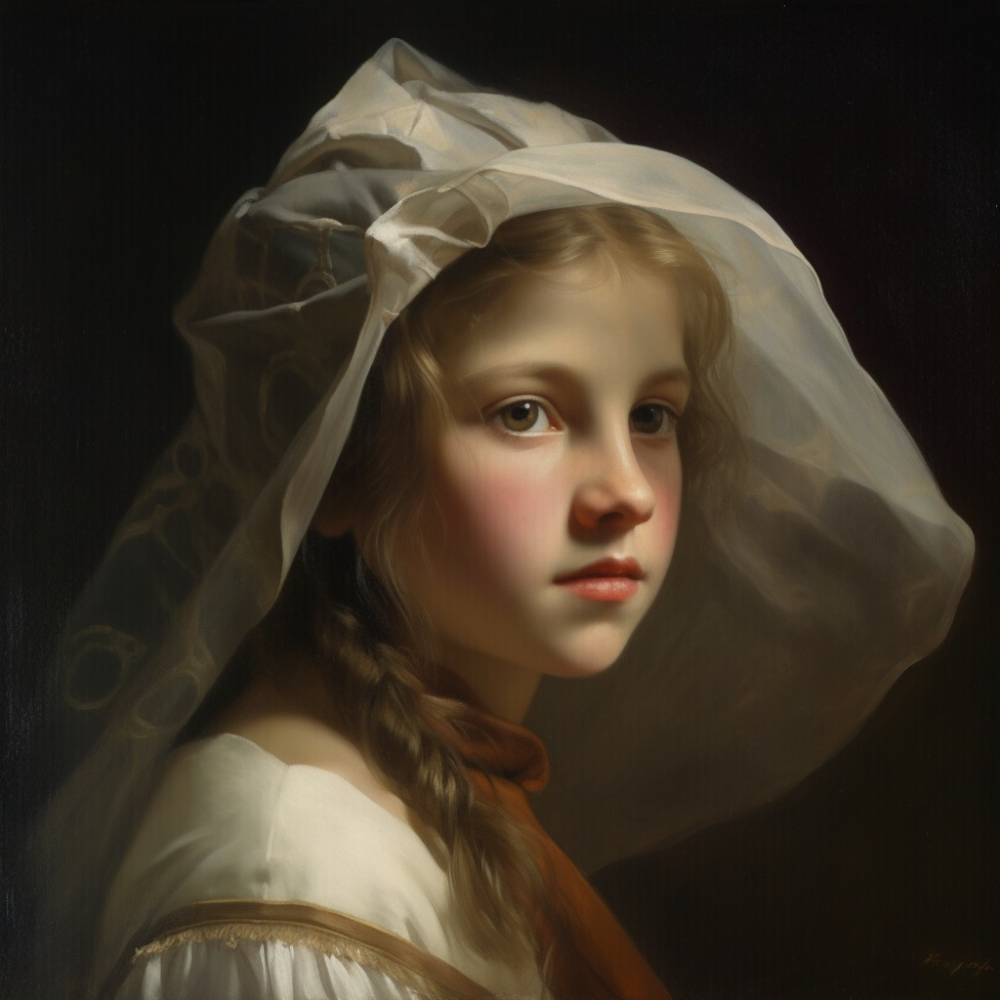     | Veiling Flare            | 透鏡毛玻璃。指當光線從透鏡或鏡頭穿過時，透過玻璃或鏡頭的反光或散射使得影象出現散射光線或最終成像看起來失真的現象。                                                                    |                                                                                                                                                |
|  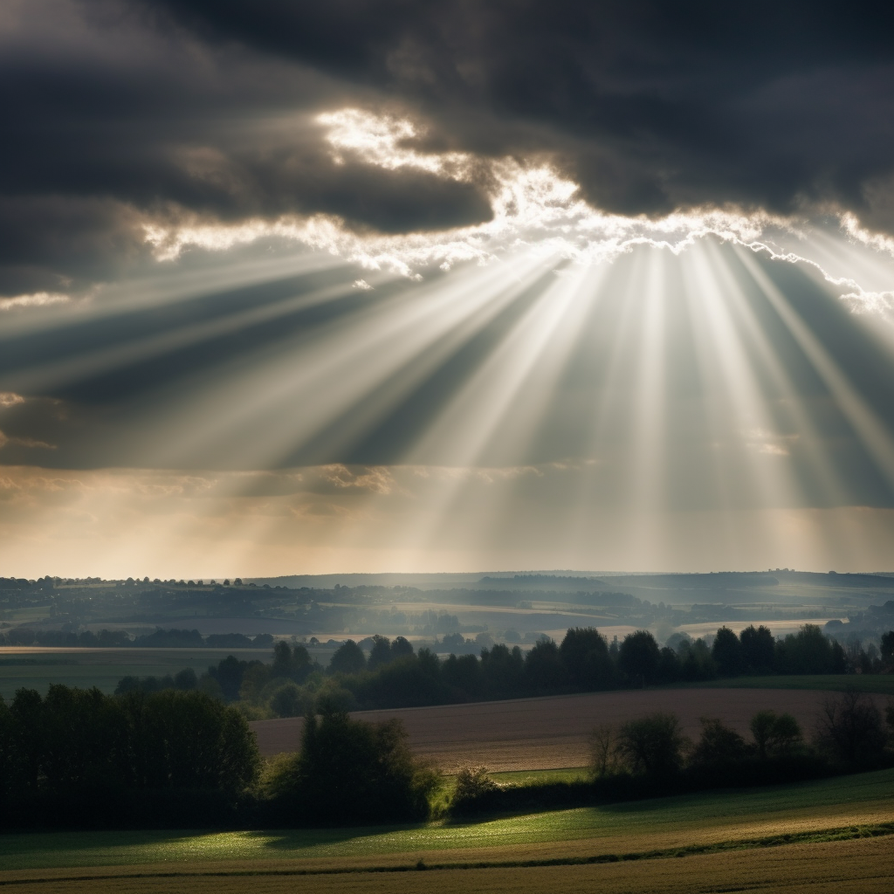      | Crepuscular Rays         | 黎明、黃昏光線。也稱為太陽光柱，是由日光在雲層或塵埃中被反射形成的光線束。因為只有在日出和日落時才有足夠的光線穿過雲層或照射到恰當的夾角，所以Crepuscular Rays通常只出現在日出和日落時刻。                        | Crepuscular Rays通常會在雲層上形成明顯的束狀光線，給人以美麗的感覺。                                                                                                     |
|  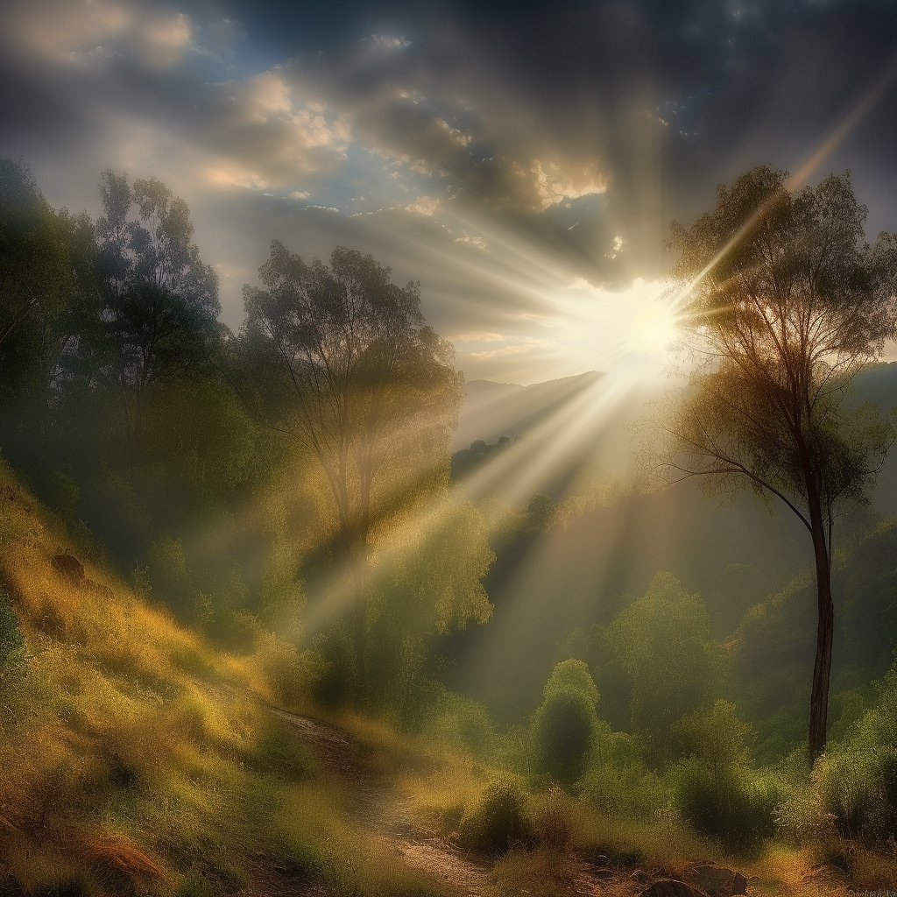      | Rays of Shimmering Light | 閃爍光線。是指在光線散射和折射時出現的光線折射現象。在某些特定的環境下，光線經過不同密度和溫度不同的氣氛，會出現一種光線折射、散射的效果，從而形成閃爍光束效果。                                             |                                                                                                                                                |
|   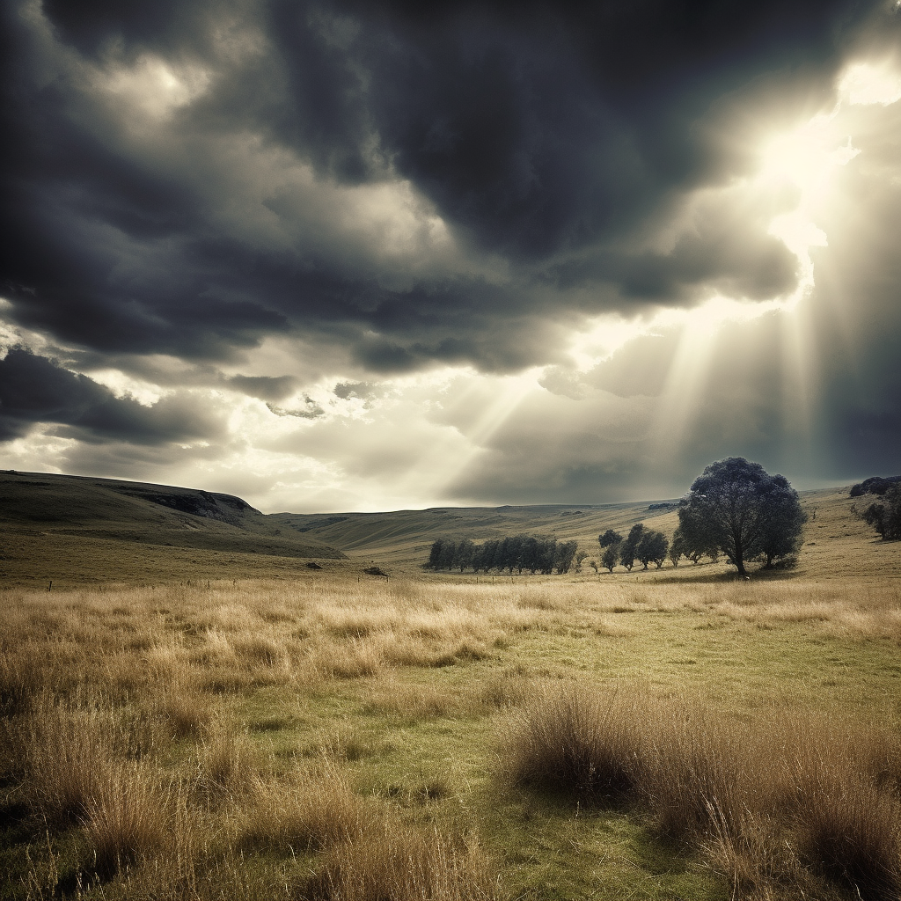     | Godrays                  | 神光。是一種由光線穿過雲朵、樹枝或其他障礙物時，形成的亮光條紋效果。Godrays通常在光線較強的時分出現，將光線分割成條紋狀，形成一種夢幻般的效果，也被稱為 "crepuscular rays" 的一種。                      |                                                                                                                                                |
